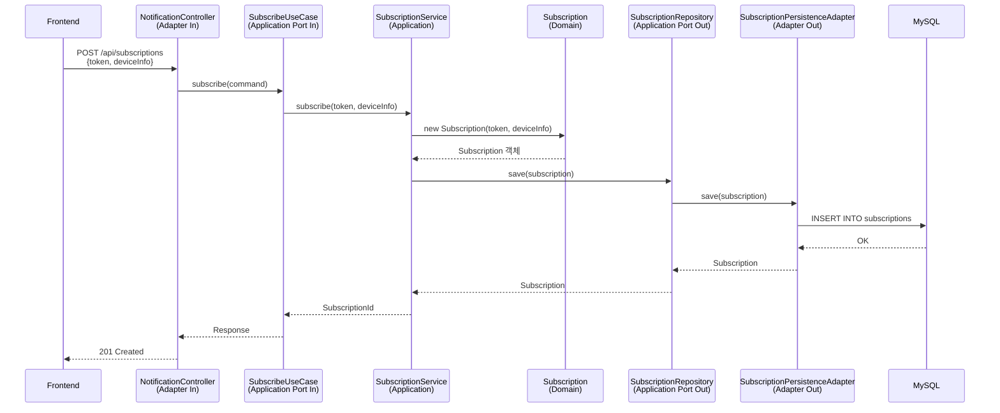
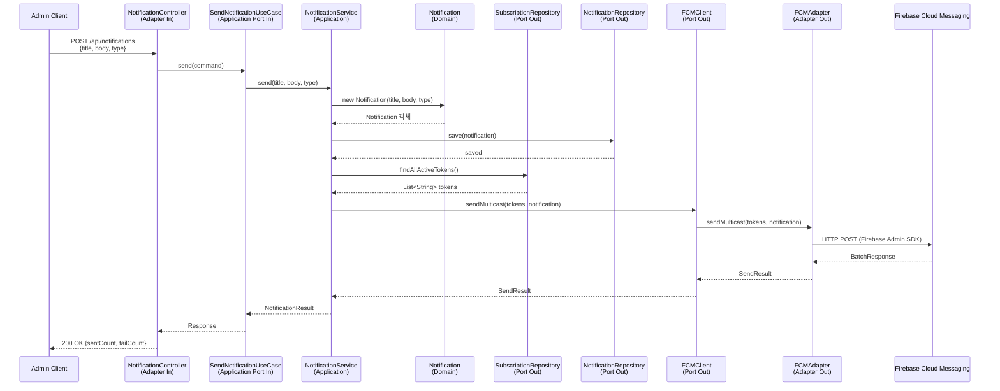

# 백엔드 알림 구현 시퀀스 (Hexagonal Architecture)

## 1. FCM 토큰 등록



## 2. 알림 발송



## 3. 패키지 구조

```
backend/src/main/java/com/busapp/
├── domain/
│   ├── Notification.java
│   ├── NotificationType.java
│   └── Subscription.java
│
├── application/
│   ├── port/
│   │   ├── in/
│   │   │   ├── SendNotificationUseCase.java
│   │   │   └── SubscribeUseCase.java
│   │   └── out/
│   │       ├── NotificationRepository.java
│   │       ├── SubscriptionRepository.java
│   │       └── FCMClient.java          # Firebase 발송 포트
│   └── service/
│       ├── NotificationService.java
│       └── SubscriptionService.java
│
└── adapter/
    ├── in/
    │   └── web/
    │       └── NotificationController.java
    └── out/
        ├── persistence/
        │   ├── NotificationPersistenceAdapter.java
        │   └── SubscriptionPersistenceAdapter.java
        └── fcm/
            └── FCMAdapter.java          # Firebase Admin SDK
```

## 4. 핵심 인터페이스

### Port In (UseCase)
```java
public interface SendNotificationUseCase {
    NotificationResult send(String title, String body, NotificationType type);
}

public interface SubscribeUseCase {
    Long subscribe(String token, String deviceInfo);
    void unsubscribe(String token);
}
```

### Port Out (외부 시스템)
```java
public interface FCMClient {
    SendResult sendMulticast(List<String> tokens, Notification notification);
}

public interface SubscriptionRepository {
    Subscription save(Subscription subscription);
    List<String> findAllActiveTokens();
    void deleteByToken(String token);
}
```

## 5. 의존성 방향

```
┌─────────────────────────────────────────────────────────┐
│                    Adapter (In)                         │
│                  NotificationController                 │
└─────────────────────────┬───────────────────────────────┘
                          │ depends on
                          ▼
┌─────────────────────────────────────────────────────────┐
│                 Application (Port In)                   │
│            SendNotificationUseCase (interface)          │
└─────────────────────────┬───────────────────────────────┘
                          │ implemented by
                          ▼
┌─────────────────────────────────────────────────────────┐
│                 Application (Service)                   │
│                 NotificationService                     │
│                          │                              │
│          depends on Domain + Port Out                   │
└───────────┬─────────────┴─────────────┬─────────────────┘
            │                           │
            ▼                           ▼
┌───────────────────────┐   ┌─────────────────────────────┐
│       Domain          │   │    Application (Port Out)   │
│     Notification      │   │  FCMClient, Repository      │
│    (no dependency)    │   │       (interfaces)          │
└───────────────────────┘   └─────────────┬───────────────┘
                                          │ implemented by
                                          ▼
                            ┌─────────────────────────────┐
                            │      Adapter (Out)          │
                            │  FCMAdapter, JpaAdapter     │
                            └─────────────────────────────┘
```
