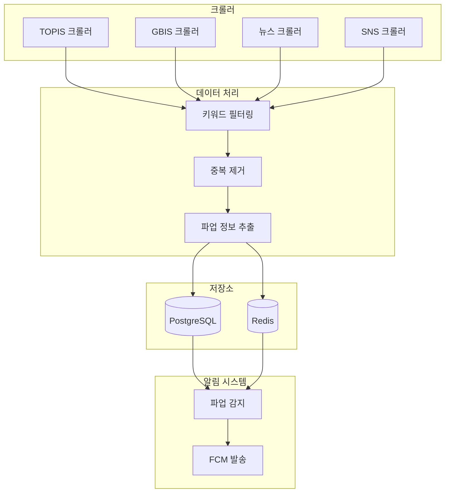
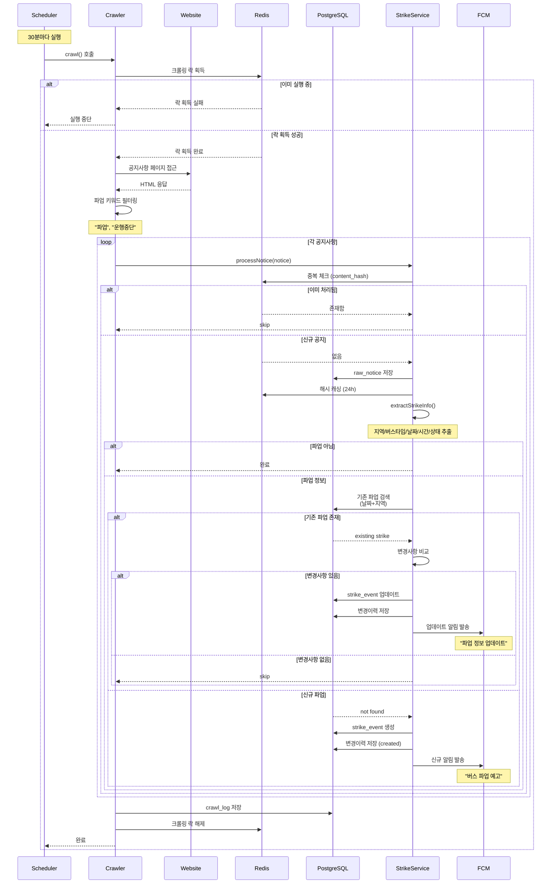
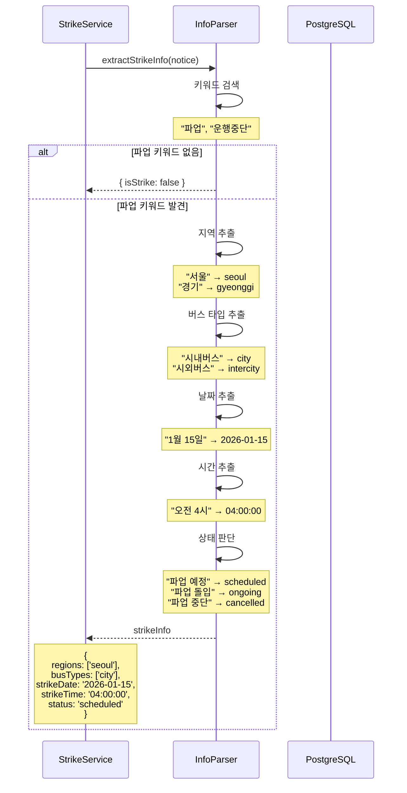
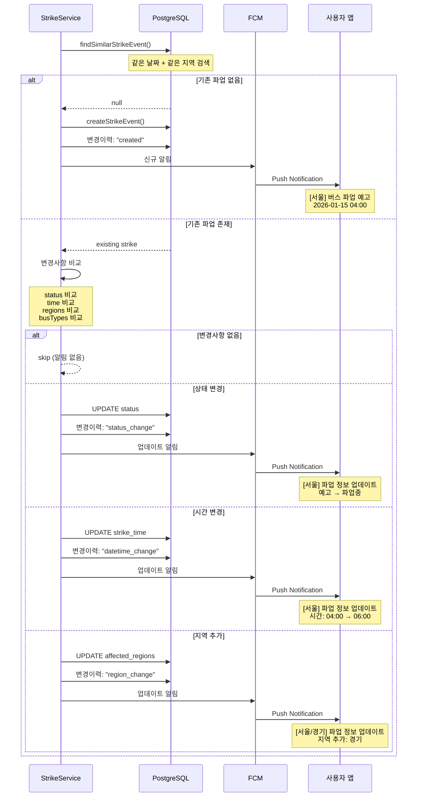
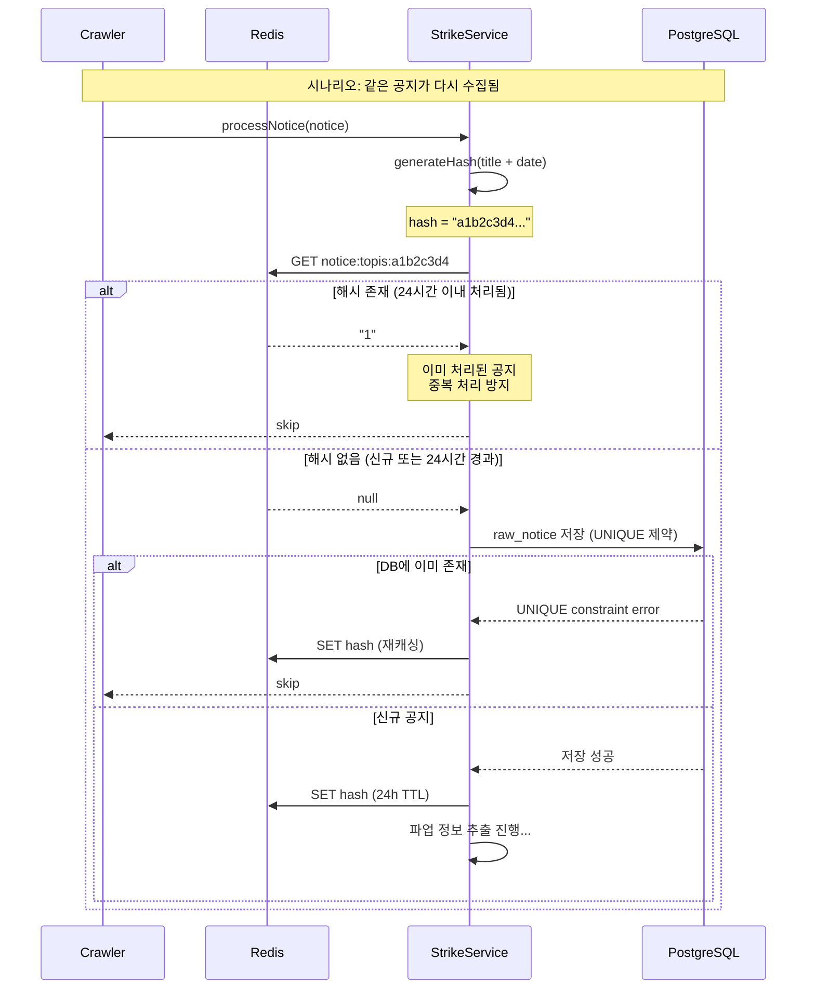

# 버스 파업 크롤링 전략

## 개요

버스 파업 정보를 자동으로 수집하기 위한 웹 크롤링 전략 문서입니다. 공식 교통정보 소스와 뉴스/SNS 등 다양한 출처에서 파업 정보를 수집하여 실시간 알림 서비스를 구현합니다.

## 크롤링 대상 소스

### 🔴 Tier 1: 필수 (공식 소스)

| 소스 | URL | 업데이트 빈도 | 크롤링 난이도 | 우선순위 |
|------|-----|---------------|---------------|----------|
| 서울 TOPIS | https://topis.seoul.go.kr/notice/openNoticeList.do | 비정기 | ⭐⭐ (동적) | P0 |
| 경기버스정보(GBIS) | https://www.gbis.go.kr/gbis2014/bbs.action?cmd=notice | 비정기 | ⭐⭐ (동적) | P0 |
| 인천교통공사 | https://www.ictr.or.kr/board/notice.do | 비정기 | ⭐⭐ (정적) | P1 |

### 🟡 Tier 2: 보조 (뉴스/SNS)

| 소스 | 특징 | 크롤링 난이도 | 우선순위 |
|------|------|---------------|----------|
| 네이버 뉴스 API | 가장 빠른 속보 | ⭐⭐ | P2 |
| 다음 뉴스 | 종합 뉴스 | ⭐⭐ | P2 |
| 트위터/X | 실시간성 최고 | ⭐⭐⭐⭐ | P2 |
| 공식 노조 트위터 | 공식 발표 | ⭐⭐⭐ | P2 |

## 상세 분석

### 1. 서울 TOPIS

**URL**: https://topis.seoul.go.kr/notice/openNoticeList.do

#### 페이지 구조
- 테이블 기반 레이아웃
- 캡션: "공지사항 목록 표 - 번호,제목,첨부,작성일,조회수"

#### 데이터 형식
```
- 번호: 순차 ID
- 제목: 하이퍼링크 형식
- 첨부: 파일 존재 여부
- 작성일: YYYY.MM.DD 형식
- 조회수: 정수값
```

#### 크롤링 방법
```javascript
// Playwright/Puppeteer 사용 (동적 로딩)
const browser = await chromium.launch();
const page = await browser.newPage();
await page.goto('https://topis.seoul.go.kr/notice/openNoticeList.do');

// 카테고리별 필터링
const categories = ['전체', '통제안내', '버스안내', '정책안내', '기상안내', '기타안내'];

// AJAX 요청 감지
await page.route('**/notice/selectNoticeList.do', route => {
  // 응답 데이터 수집
  route.continue();
});

// 페이지네이션 처리
for (let pageNo = 1; pageNo <= totalPages; pageNo++) {
  await page.evaluate((pageNo) => {
    fn_getNoticeList(pageNo);
  }, pageNo);

  await page.waitForResponse('**/selectNoticeList.do');
  // 데이터 추출
}
```

#### 주의사항
- JavaScript 기반 동적 로딩 (AJAX)
- 6개 카테고리별 조회 필요
- 첨부파일 별도 요청 (`selectNoticeFileDown.do`)
- User-Agent 헤더 필수

#### 파업 키워드
- "파업"
- "운행중단"
- "버스운행"
- "노사협상"
- "단체교섭"

---

### 2. 경기버스정보(GBIS)

**URL**: https://www.gbis.go.kr/gbis2014/bbs.action?cmd=notice

#### 페이지 구조
- 헤더: 로고, 네비게이션, 날씨 정보
- 서브 네비게이션: 참여마당 > 공지사항
- 필터: 전체공지, 시내버스공지, 시외버스공지

#### 데이터 형식
```
- 번호
- 제목
- 카테고리
- 등록일
- 조회수
```

#### 크롤링 방법
```javascript
// Playwright 사용
const page = await browser.newPage();
await page.goto('https://www.gbis.go.kr/gbis2014/bbs.action?cmd=notice');

// 필터 선택 (시내버스공지)
await page.selectOption('select[name="category"]', '시내버스공지');
await page.click('button[type="submit"]');

// 테이블 파싱
const notices = await page.$$eval('table tbody tr', rows => {
  return rows.map(row => {
    const cells = row.querySelectorAll('td');
    return {
      number: cells[0]?.textContent?.trim(),
      title: cells[1]?.textContent?.trim(),
      category: cells[2]?.textContent?.trim(),
      date: cells[3]?.textContent?.trim(),
      views: cells[4]?.textContent?.trim()
    };
  });
});

// 상세 페이지 크롤링
for (const notice of notices) {
  if (notice.title.includes('파업')) {
    // 상세 내용 수집
  }
}
```

#### 주의사항
- JavaScript 렌더링 필요 (Selenium/Playwright)
- 필터 적용 후 검색 필요
- 페이지네이션 메커니즘 확인

---

## 크롤링 아키텍처

### 시스템 구성도



### 시퀀스 다이어그램

#### 1. 전체 크롤링 프로세스



#### 2. 파업 정보 추출 상세



#### 3. 변경 감지 및 알림



#### 4. 중복 방지 메커니즘



### 데이터 흐름

1. **수집 (Collection)**
   - 스케줄러: **30분마다 실행** (Tier 1), 2시간마다 (Tier 2)
   - 병렬 처리: 각 소스별 독립적 크롤링

2. **처리 (Processing)**
   - 키워드 매칭: "파업", "운행중단", "노사협상" 등
   - **파업 정보 추출**:
     - 지역: 서울/경기
     - 버스 타입: 시내버스/시외버스
     - 날짜, 시간
     - 진행 상태: 예고(scheduled) / 파업중(ongoing) / 파업중단(cancelled)
   - 중복 제거: 제목 + 날짜 기반 해싱
   - **변경 감지**: 기존 파업 정보와 비교하여 업데이트 여부 확인

3. **저장 (Storage)**
   - PostgreSQL: 원본 데이터, 파업 이벤트
   - Redis: 중복 체크용 해시 캐싱 (24시간)

4. **알림 (Notification)**
   - **신규 파업 등록 시**: 즉시 알림 발송
   - **기존 파업 업데이트 시**: 변경 알림 발송
     - 날짜/시간 변경
     - 상태 변경 (예고 → 파업중 → 파업중단)
     - 지역/노선 범위 변경

---

## 기술 스택

### 크롤링 도구

| 도구 | 용도 | 장점 | 단점 |
|------|------|------|------|
| **Playwright** | 동적 페이지 크롤링 | 빠름, 안정적, TypeScript 지원 | 리소스 많이 사용 |
| **Cheerio** | 정적 페이지 파싱 | 빠름, 가벼움 | 동적 콘텐츠 불가 |
| **Axios** | HTTP 요청 | 간단, 빠름 | 정적 콘텐츠만 |
| **node-cron** | 스케줄링 | 간단한 설정 | 분산 환경 어려움 |

### 추천 스택
```javascript
// 크롤링
- Playwright (동적 페이지)
- Cheerio (정적 페이지 파싱)
- Axios (API 요청)

// 스케줄링
- node-cron 또는 Agenda (MongoDB 기반)

// 데이터 처리
- Natural (NLP - 한국어 지원 제한적)
- @tensorflow/tfjs (ML 기반 분류)

// 모니터링
- Winston (로깅)
- Sentry (에러 트래킹)
```

---

## 구현 예시

### 1. TOPIS 크롤러

```javascript
// crawlers/topis.js
const { chromium } = require('playwright');
const cheerio = require('cheerio');

class TOPISCrawler {
  constructor() {
    this.baseUrl = 'https://topis.seoul.go.kr/notice/openNoticeList.do';
    this.strikeKeywords = ['파업', '운행중단', '버스운행', '노사협상'];
  }

  async crawl() {
    const browser = await chromium.launch({ headless: true });
    const page = await browser.newPage();

    try {
      await page.goto(this.baseUrl, { waitUntil: 'networkidle' });

      // 버스안내 탭 클릭
      await page.click('a:has-text("버스안내")');
      await page.waitForTimeout(1000);

      // 공지사항 목록 추출
      const notices = await page.$$eval('table tbody tr', rows => {
        return rows.map(row => {
          const cells = row.querySelectorAll('td');
          return {
            number: cells[0]?.textContent?.trim(),
            title: cells[1]?.querySelector('a')?.textContent?.trim(),
            link: cells[1]?.querySelector('a')?.getAttribute('href'),
            hasAttachment: cells[2]?.querySelector('img') !== null,
            date: cells[3]?.textContent?.trim(),
            views: cells[4]?.textContent?.trim()
          };
        });
      });

      // 파업 관련 공지 필터링
      const strikeNotices = notices.filter(notice => {
        return this.strikeKeywords.some(keyword =>
          notice.title?.includes(keyword)
        );
      });

      // 상세 내용 크롤링
      const detailedNotices = [];
      for (const notice of strikeNotices) {
        const detail = await this.getNoticeDetail(page, notice);
        detailedNotices.push(detail);
      }

      return detailedNotices;

    } finally {
      await browser.close();
    }
  }

  async getNoticeDetail(page, notice) {
    // 상세 페이지로 이동
    await page.click(`a:has-text("${notice.title}")`);
    await page.waitForTimeout(1000);

    // 상세 내용 추출
    const content = await page.$eval('.content', el => el.textContent);

    // 뒤로 가기
    await page.goBack();

    return {
      ...notice,
      content,
      source: 'TOPIS',
      crawledAt: new Date()
    };
  }
}

module.exports = TOPISCrawler;
```

### 2. GBIS 크롤러

```javascript
// crawlers/gbis.js
const { chromium } = require('playwright');

class GBISCrawler {
  constructor() {
    this.baseUrl = 'https://www.gbis.go.kr/gbis2014/bbs.action?cmd=notice';
    this.strikeKeywords = ['파업', '운행중단', '버스운행'];
  }

  async crawl() {
    const browser = await chromium.launch({ headless: true });
    const page = await browser.newPage();

    try {
      await page.goto(this.baseUrl, { waitUntil: 'networkidle' });

      // 시내버스공지 필터 선택
      await page.selectOption('select[name="category"]', '시내버스공지');
      await page.click('button[type="submit"]');
      await page.waitForTimeout(1000);

      // 공지사항 목록 추출
      const notices = await page.$$eval('table tbody tr', rows => {
        return rows.map(row => {
          const cells = row.querySelectorAll('td');
          return {
            number: cells[0]?.textContent?.trim(),
            title: cells[1]?.textContent?.trim(),
            category: cells[2]?.textContent?.trim(),
            date: cells[3]?.textContent?.trim(),
            views: cells[4]?.textContent?.trim()
          };
        });
      });

      // 파업 관련 필터링
      const strikeNotices = notices.filter(notice => {
        return this.strikeKeywords.some(keyword =>
          notice.title?.includes(keyword)
        );
      });

      return strikeNotices.map(notice => ({
        ...notice,
        source: 'GBIS',
        crawledAt: new Date()
      }));

    } finally {
      await browser.close();
    }
  }
}

module.exports = GBISCrawler;
```

### 3. 크롤러 스케줄러

```javascript
// scheduler.js
const cron = require('node-cron');
const TOPISCrawler = require('./crawlers/topis');
const GBISCrawler = require('./crawlers/gbis');
const StrikeService = require('./services/strike');

class CrawlerScheduler {
  constructor() {
    this.topisCrawler = new TOPISCrawler();
    this.gbisCrawler = new GBISCrawler();
    this.strikeService = new StrikeService();
  }

  start() {
    // Tier 1: 30분마다 실행
    cron.schedule('*/30 * * * *', async () => {
      console.log('Starting Tier 1 crawling...');
      await this.crawlTier1();
    });

    // 초기 실행
    this.crawlTier1();
  }

  async crawlTier1() {
    try {
      // 병렬 실행
      const [topisNotices, gbisNotices] = await Promise.all([
        this.topisCrawler.crawl(),
        this.gbisCrawler.crawl()
      ]);

      const allNotices = [...topisNotices, ...gbisNotices];

      // 파업 이벤트 처리
      for (const notice of allNotices) {
        await this.strikeService.processNotice(notice);
      }

      console.log(`Processed ${allNotices.length} notices`);

    } catch (error) {
      console.error('Crawling error:', error);
      // Sentry.captureException(error);
    }
  }
}

// 실행
const scheduler = new CrawlerScheduler();
scheduler.start();
```

### 4. 파업 정보 처리 서비스

```javascript
// services/strike.js
const crypto = require('crypto');

class StrikeService {
  constructor(db, redis, notificationService) {
    this.db = db;
    this.redis = redis;
    this.notificationService = notificationService;
  }

  async processNotice(notice) {
    // 중복 체크 (제목 + 날짜 해시)
    const hash = this.generateHash(notice.title + notice.date);
    const exists = await this.redis.get(`notice:${hash}`);

    if (exists) {
      return; // 이미 처리된 공지
    }

    // 파업 정보 추출
    const strikeInfo = this.extractStrikeInfo(notice);

    if (strikeInfo.isStrike) {
      // DB 저장
      const strike = await this.db.strikes.create({
        title: notice.title,
        content: notice.content,
        source: notice.source,
        startDate: strikeInfo.startDate,
        endDate: strikeInfo.endDate,
        affectedRegions: strikeInfo.regions,
        status: 'confirmed',
        originalUrl: notice.link
      });

      // Redis 캐시
      await this.redis.set(`notice:${hash}`, '1', 'EX', 86400);

      // 알림 발송
      await this.notificationService.sendStrikeAlert(strike);
    }
  }

  extractStrikeInfo(notice) {
    const text = notice.title + ' ' + (notice.content || '');

    // 키워드 매칭
    const isStrike = /파업|운행중단|노사협상 결렬/.test(text);

    // 날짜 추출 (정규식)
    const datePattern = /(\d{1,2})월\s*(\d{1,2})일/g;
    const dates = [...text.matchAll(datePattern)];

    // 지역 추출
    const regions = [];
    if (text.includes('서울')) regions.push('seoul');
    if (text.includes('경기')) regions.push('gyeonggi');
    if (text.includes('인천')) regions.push('incheon');

    return {
      isStrike,
      startDate: dates[0] ? this.parseDate(dates[0]) : null,
      endDate: dates[1] ? this.parseDate(dates[1]) : null,
      regions
    };
  }

  generateHash(text) {
    return crypto.createHash('md5').update(text).digest('hex');
  }

  parseDate(match) {
    const month = parseInt(match[1]);
    const day = parseInt(match[2]);
    const year = new Date().getFullYear();
    return new Date(year, month - 1, day);
  }
}

module.exports = StrikeService;
```

---

## 법적 고려사항

### 저작권 및 이용약관

| 사이트 | 크롤링 허용 여부 | 확인 필요 사항 |
|--------|-----------------|----------------|
| TOPIS | robots.txt 확인 필요 | 공공데이터 활용 가능성 |
| GBIS | robots.txt 확인 필요 | 공공데이터 포털 API 우선 |
| 뉴스 사이트 | 저작권 문제 | API 이용 또는 출처 표기 |

### 권장사항
1. **공공데이터 API 우선 사용**: 크롤링 대신 공식 API 활용
2. **robots.txt 준수**: 사이트별 크롤링 정책 확인
3. **Rate Limiting**: 요청 빈도 제한 (10초당 1회)
4. **User-Agent 설정**: 봇 신원 명확히 표기
5. **출처 표기**: 원본 링크 및 출처 명시

```javascript
// robots.txt 체크 예시
const robotsParser = require('robots-parser');

async function checkRobots(url) {
  const robots = await fetch(url + '/robots.txt');
  const parser = robotsParser(url + '/robots.txt', await robots.text());
  return parser.isAllowed(url, 'BusStrikeBot/1.0');
}
```

---

## 모니터링 및 알림

### 크롤러 상태 모니터링

```javascript
// monitoring.js
const winston = require('winston');

const logger = winston.createLogger({
  level: 'info',
  format: winston.format.json(),
  transports: [
    new winston.transports.File({ filename: 'error.log', level: 'error' }),
    new winston.transports.File({ filename: 'crawler.log' })
  ]
});

class CrawlerMonitor {
  async logCrawl(crawler, success, itemCount, error = null) {
    const log = {
      crawler,
      success,
      itemCount,
      timestamp: new Date(),
      error: error?.message
    };

    if (success) {
      logger.info('Crawl completed', log);
    } else {
      logger.error('Crawl failed', log);
    }

    // 슬랙 알림 (실패 시)
    if (!success) {
      await this.sendSlackAlert(log);
    }
  }

  async sendSlackAlert(log) {
    // Slack webhook 호출
  }
}
```

---

## 다음 단계

### Phase 1: MVP (1-2주)
- [ ] TOPIS, GBIS 크롤러 구현
- [ ] 기본 스케줄러 구현
- [ ] PostgreSQL 저장
- [ ] 키워드 기반 필터링

### Phase 2: 고도화 (3-4주)
- [ ] 뉴스 크롤러 추가
- [ ] NLP 기반 파업 감지
- [ ] Redis 캐싱
- [ ] 크롤러 모니터링

### Phase 3: 확장 (5-6주)
- [ ] SNS 크롤러 추가
- [ ] ML 기반 파업 예측
- [ ] 분산 크롤링 (여러 서버)

---

## 참고 자료

- [Playwright 공식 문서](https://playwright.dev/)
- [Cheerio GitHub](https://github.com/cheeriojs/cheerio)
- [node-cron](https://www.npmjs.com/package/node-cron)
- [공공데이터포털](https://www.data.go.kr/)
- [robots.txt 파서](https://www.npmjs.com/package/robots-parser)
