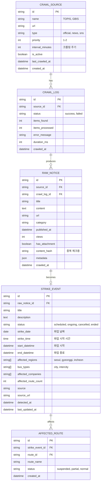

# 크롤링 데이터베이스 스키마

## ERD



## 테이블 상세

### 1. crawl_sources (크롤링 소스)

```sql
CREATE TABLE crawl_sources (
    id VARCHAR(50) PRIMARY KEY,
    name VARCHAR(100) NOT NULL,
    url TEXT NOT NULL,
    type VARCHAR(20) NOT NULL CHECK (type IN ('official', 'news', 'sns')),
    priority INT NOT NULL CHECK (priority BETWEEN 1 AND 3),
    interval_minutes INT NOT NULL DEFAULT 10,
    is_active BOOLEAN NOT NULL DEFAULT true,
    last_crawled_at TIMESTAMP,
    created_at TIMESTAMP NOT NULL DEFAULT NOW()
);

-- 초기 데이터
INSERT INTO crawl_sources (id, name, url, type, priority, interval_minutes) VALUES
('topis', 'TOPIS', 'https://topis.seoul.go.kr/notice/openNoticeList.do', 'official', 1, 10),
('gbis', 'GBIS', 'https://www.gbis.go.kr/gbis2014/bbs.action?cmd=notice', 'official', 1, 10),
('ictr', 'ICTR', 'https://www.ictr.or.kr/board/notice.do', 'official', 1, 30);
```

### 2. crawl_logs (크롤링 로그)

```sql
CREATE TABLE crawl_logs (
    id VARCHAR(50) PRIMARY KEY,
    source_id VARCHAR(50) NOT NULL REFERENCES crawl_sources(id),
    status VARCHAR(20) NOT NULL CHECK (status IN ('success', 'failed', 'partial')),
    items_found INT NOT NULL DEFAULT 0,
    items_processed INT NOT NULL DEFAULT 0,
    error_message TEXT,
    duration_ms INT,
    crawled_at TIMESTAMP NOT NULL DEFAULT NOW(),

    INDEX idx_source_id (source_id),
    INDEX idx_crawled_at (crawled_at)
);
```

### 3. raw_notices (원본 공지사항)

```sql
CREATE TABLE raw_notices (
    id VARCHAR(50) PRIMARY KEY,
    source_id VARCHAR(50) NOT NULL REFERENCES crawl_sources(id),
    crawl_log_id VARCHAR(50) REFERENCES crawl_logs(id),
    title TEXT NOT NULL,
    content TEXT,
    url TEXT,
    category VARCHAR(50),
    published_at TIMESTAMP,
    views INT,
    has_attachment BOOLEAN DEFAULT false,
    content_hash VARCHAR(32) NOT NULL,
    metadata JSONB,
    crawled_at TIMESTAMP NOT NULL DEFAULT NOW(),

    INDEX idx_source_id (source_id),
    INDEX idx_content_hash (content_hash),
    INDEX idx_published_at (published_at),
    UNIQUE (source_id, content_hash)
);

-- 전문 검색 인덱스
CREATE INDEX idx_raw_notices_title_fts ON raw_notices USING gin(to_tsvector('korean', title));
CREATE INDEX idx_raw_notices_content_fts ON raw_notices USING gin(to_tsvector('korean', content));
```

### 4. strike_events (파업 이벤트)

```sql
CREATE TABLE strike_events (
    id VARCHAR(50) PRIMARY KEY,
    raw_notice_id VARCHAR(50) REFERENCES raw_notices(id),
    title VARCHAR(200) NOT NULL,
    description TEXT,
    status VARCHAR(20) NOT NULL DEFAULT 'scheduled'
        CHECK (status IN ('scheduled', 'ongoing', 'cancelled', 'ended')),
    strike_date DATE,
    strike_time TIME,
    start_datetime TIMESTAMP,
    end_datetime TIMESTAMP,
    affected_regions TEXT[] DEFAULT '{}',
    bus_types TEXT[] DEFAULT '{}',
    affected_companies TEXT[] DEFAULT '{}',
    affected_route_count INT DEFAULT 0,
    source VARCHAR(50) NOT NULL,
    source_url TEXT,
    detected_at TIMESTAMP NOT NULL DEFAULT NOW(),
    last_updated_at TIMESTAMP NOT NULL DEFAULT NOW(),

    INDEX idx_status (status),
    INDEX idx_strike_date (strike_date),
    INDEX idx_detected_at (detected_at),
    INDEX idx_affected_regions (affected_regions),
    INDEX idx_bus_types (bus_types)
);

-- 상태 변경 이력을 위한 트리거
CREATE OR REPLACE FUNCTION update_strike_updated_at()
RETURNS TRIGGER AS $$
BEGIN
    NEW.last_updated_at = NOW();
    RETURN NEW;
END;
$$ LANGUAGE plpgsql;

CREATE TRIGGER strike_events_updated_at
    BEFORE UPDATE ON strike_events
    FOR EACH ROW
    EXECUTE FUNCTION update_strike_updated_at();
```

### 5. affected_routes (영향 노선)

```sql
CREATE TABLE affected_routes (
    id VARCHAR(50) PRIMARY KEY,
    strike_event_id VARCHAR(50) NOT NULL REFERENCES strike_events(id) ON DELETE CASCADE,
    route_id VARCHAR(50) NOT NULL,
    route_name VARCHAR(100) NOT NULL,
    status VARCHAR(20) NOT NULL DEFAULT 'suspended'
        CHECK (status IN ('suspended', 'partial', 'normal')),
    created_at TIMESTAMP NOT NULL DEFAULT NOW(),

    INDEX idx_strike_event_id (strike_event_id),
    INDEX idx_route_id (route_id),
    UNIQUE (strike_event_id, route_id)
);
```

### 6. strike_event_changes (파업 이벤트 변경 이력)

```sql
CREATE TABLE strike_event_changes (
    id VARCHAR(50) PRIMARY KEY,
    strike_event_id VARCHAR(50) NOT NULL REFERENCES strike_events(id) ON DELETE CASCADE,
    change_type VARCHAR(50) NOT NULL
        CHECK (change_type IN ('status_change', 'datetime_change', 'region_change', 'created')),
    old_value JSONB,
    new_value JSONB,
    changed_at TIMESTAMP NOT NULL DEFAULT NOW(),

    INDEX idx_strike_event_id (strike_event_id),
    INDEX idx_changed_at (changed_at)
);

-- 변경 이력 자동 기록 트리거
CREATE OR REPLACE FUNCTION log_strike_event_changes()
RETURNS TRIGGER AS $$
BEGIN
    -- 상태 변경
    IF OLD.status IS DISTINCT FROM NEW.status THEN
        INSERT INTO strike_event_changes (id, strike_event_id, change_type, old_value, new_value)
        VALUES (
            'change_' || extract(epoch from now())::bigint || '_' || floor(random() * 1000)::int,
            NEW.id,
            'status_change',
            jsonb_build_object('status', OLD.status),
            jsonb_build_object('status', NEW.status)
        );
    END IF;

    -- 날짜/시간 변경
    IF OLD.strike_date IS DISTINCT FROM NEW.strike_date OR OLD.strike_time IS DISTINCT FROM NEW.strike_time THEN
        INSERT INTO strike_event_changes (id, strike_event_id, change_type, old_value, new_value)
        VALUES (
            'change_' || extract(epoch from now())::bigint || '_' || floor(random() * 1000)::int,
            NEW.id,
            'datetime_change',
            jsonb_build_object('date', OLD.strike_date, 'time', OLD.strike_time),
            jsonb_build_object('date', NEW.strike_date, 'time', NEW.strike_time)
        );
    END IF;

    -- 지역 변경
    IF OLD.affected_regions IS DISTINCT FROM NEW.affected_regions THEN
        INSERT INTO strike_event_changes (id, strike_event_id, change_type, old_value, new_value)
        VALUES (
            'change_' || extract(epoch from now())::bigint || '_' || floor(random() * 1000)::int,
            NEW.id,
            'region_change',
            jsonb_build_object('regions', OLD.affected_regions),
            jsonb_build_object('regions', NEW.affected_regions)
        );
    END IF;

    RETURN NEW;
END;
$$ LANGUAGE plpgsql;

CREATE TRIGGER log_strike_changes
    AFTER UPDATE ON strike_events
    FOR EACH ROW
    EXECUTE FUNCTION log_strike_event_changes();

-- 신규 생성 시에도 기록
CREATE OR REPLACE FUNCTION log_strike_event_created()
RETURNS TRIGGER AS $$
BEGIN
    INSERT INTO strike_event_changes (id, strike_event_id, change_type, new_value)
    VALUES (
        'change_' || extract(epoch from now())::bigint || '_' || floor(random() * 1000)::int,
        NEW.id,
        'created',
        jsonb_build_object(
            'status', NEW.status,
            'date', NEW.strike_date,
            'time', NEW.strike_time,
            'regions', NEW.affected_regions
        )
    );
    RETURN NEW;
END;
$$ LANGUAGE plpgsql;

CREATE TRIGGER log_strike_created
    AFTER INSERT ON strike_events
    FOR EACH ROW
    EXECUTE FUNCTION log_strike_event_created();
```

## Redis 캐싱 스키마

### Key 구조

```
# 최근 공지사항 캐시 (24시간)
notice:{source_id}:{content_hash} = "1"
TTL: 86400 (24시간)

# 크롤링 락 (동시 실행 방지)
crawl:lock:{source_id} = "1"
TTL: 300 (5분)

# 최근 파업 이벤트 (실시간 조회용)
strike:active = [strike_event_ids]
TTL: 3600 (1시간)

# 크롤러 상태
crawler:status:{source_id} = {
    "last_run": "2026-01-13T10:00:00Z",
    "status": "success",
    "next_run": "2026-01-13T10:10:00Z"
}
TTL: 7200 (2시간)
```

### Redis 사용 예시

```javascript
// 중복 체크
const hash = generateHash(notice.title + notice.date);
const exists = await redis.get(`notice:${notice.source}:${hash}`);
if (!exists) {
    await redis.set(`notice:${notice.source}:${hash}`, '1', 'EX', 86400);
}

// 크롤링 락
const lockKey = `crawl:lock:${sourceId}`;
const locked = await redis.set(lockKey, '1', 'NX', 'EX', 300);
if (!locked) {
    console.log('Crawling already in progress');
    return;
}

// 활성 파업 캐싱
const activeStrikes = await db.strikes.findMany({ status: 'ongoing' });
await redis.set('strike:active', JSON.stringify(activeStrikes), 'EX', 3600);
```

## 쿼리 예시

### 1. 최근 24시간 크롤링 통계

```sql
SELECT
    cs.name,
    COUNT(*) as total_crawls,
    SUM(CASE WHEN cl.status = 'success' THEN 1 ELSE 0 END) as success_count,
    AVG(cl.duration_ms) as avg_duration_ms,
    SUM(cl.items_found) as total_items,
    MAX(cl.crawled_at) as last_crawled
FROM crawl_logs cl
JOIN crawl_sources cs ON cl.source_id = cs.id
WHERE cl.crawled_at >= NOW() - INTERVAL '24 hours'
GROUP BY cs.name
ORDER BY last_crawled DESC;
```

### 2. 파업 키워드 검색

```sql
SELECT
    rn.id,
    rn.title,
    rn.published_at,
    cs.name as source_name,
    ts_rank(to_tsvector('korean', rn.title || ' ' || COALESCE(rn.content, '')),
            to_tsquery('korean', '파업 | 운행중단')) as relevance
FROM raw_notices rn
JOIN crawl_sources cs ON rn.source_id = cs.id
WHERE
    to_tsvector('korean', rn.title || ' ' || COALESCE(rn.content, ''))
    @@ to_tsquery('korean', '파업 | 운행중단')
    AND rn.published_at >= NOW() - INTERVAL '7 days'
ORDER BY relevance DESC, rn.published_at DESC
LIMIT 20;
```

### 3. 미처리 공지사항 찾기

```sql
SELECT
    rn.id,
    rn.title,
    rn.published_at,
    cs.name as source_name
FROM raw_notices rn
JOIN crawl_sources cs ON rn.source_id = cs.id
LEFT JOIN strike_events se ON rn.id = se.raw_notice_id
WHERE
    se.id IS NULL
    AND (
        rn.title ILIKE '%파업%'
        OR rn.title ILIKE '%운행중단%'
        OR rn.content ILIKE '%파업%'
    )
    AND rn.published_at >= NOW() - INTERVAL '30 days'
ORDER BY rn.published_at DESC;
```

### 4. 활성 파업 이벤트 조회

```sql
SELECT
    se.id,
    se.title,
    se.status,
    se.start_date,
    se.end_date,
    se.affected_regions,
    COUNT(ar.id) as affected_route_count,
    se.source,
    se.detected_at
FROM strike_events se
LEFT JOIN affected_routes ar ON se.id = ar.strike_event_id
WHERE
    se.status IN ('confirmed', 'ongoing')
    AND (se.end_date IS NULL OR se.end_date >= NOW())
GROUP BY se.id
ORDER BY se.start_date DESC;
```

## 인덱스 최적화

```sql
-- 복합 인덱스 (자주 사용하는 쿼리 패턴)
CREATE INDEX idx_raw_notices_source_published ON raw_notices(source_id, published_at DESC);
CREATE INDEX idx_strike_events_status_start ON strike_events(status, start_date DESC);

-- 부분 인덱스 (활성 데이터만)
CREATE INDEX idx_active_strikes ON strike_events(start_date)
WHERE status IN ('confirmed', 'ongoing');

-- JSON 인덱스
CREATE INDEX idx_raw_notices_metadata ON raw_notices USING gin(metadata);
```

## 데이터 유지 정책

### 보관 기간

| 테이블 | 보관 기간 | 아카이빙 |
|--------|-----------|----------|
| crawl_logs | 30일 | 별도 로그 서버 |
| raw_notices | 1년 | S3 백업 |
| strike_events | 영구 | - |
| affected_routes | 영구 | - |

### 자동 정리 스크립트

```sql
-- 오래된 크롤링 로그 삭제 (30일 이상)
DELETE FROM crawl_logs
WHERE crawled_at < NOW() - INTERVAL '30 days';

-- 오래된 원본 공지 아카이빙 (1년 이상)
-- 실제 구현 시 배치 작업으로 S3에 백업 후 삭제
```
