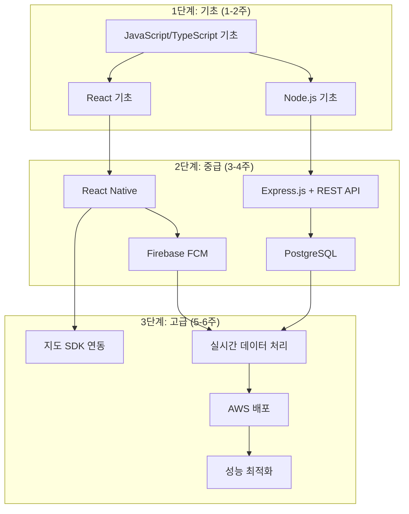
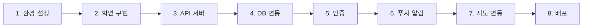

# 서울/경기 버스 파업 알림 앱 학습 로드맵

## 기술 스택

| 기술 | 숙련도 필요 | 우선순위 | 학습 시간 |
|------|-------------|----------|-----------|
| React Native | 중급 | P0 | 3주 |
| TypeScript | 중급 | P0 | 1주 |
| Node.js/Express | 중급 | P0 | 2주 |
| PostgreSQL | 초급 | P1 | 1주 |
| Redis | 초급 | P1 | 3일 |
| Firebase (FCM) | 초급 | P0 | 3일 |
| 카카오맵/네이버지도 SDK | 초급 | P1 | 1주 |
| REST API 설계 | 중급 | P0 | 1주 |
| AWS (EC2, RDS) | 초급 | P2 | 1주 |

## 학습 경로 다이어그램

## 기초 단계 (1-2주)

| 주제 | 적용 기능 | 리소스 |
|------|-----------|--------|
| JavaScript ES6+ | 전체 | MDN Web Docs |
| TypeScript 기초 | 전체 | TypeScript 공식 문서 |
| React 기초 (컴포넌트, 상태, 훅) | 모든 UI | React 공식 문서 |
| Node.js 기초 | 백엔드 전체 | Node.js 공식 문서 |
| Git/GitHub | 협업 | Pro Git Book |

### 주차별 체크리스트

#### 1주차
- [ ] JavaScript ES6+ 문법 (arrow function, destructuring, spread)
- [ ] TypeScript 기본 타입, 인터페이스
- [ ] React 함수형 컴포넌트
- [ ] useState, useEffect 훅

#### 2주차
- [ ] React Context API
- [ ] Node.js 모듈 시스템
- [ ] npm/yarn 패키지 관리
- [ ] Git 브랜치 전략

## 중급 단계 (3-4주)

| 주제 | 적용 기능 | 리소스 |
|------|-----------|--------|
| React Native 기초 | 앱 UI 전체 | React Native 공식 문서 |
| React Navigation | 화면 전환 | React Navigation 문서 |
| Express.js | API 서버 | Express 공식 문서 |
| REST API 설계 | 모든 API | REST API 디자인 가이드 |
| PostgreSQL 기초 | 데이터 저장 | PostgreSQL 튜토리얼 |
| Firebase FCM | 푸시 알림 | Firebase 문서 |
| JWT 인증 | 사용자 인증 | JWT.io |

### 주차별 체크리스트

#### 3주차
- [ ] React Native 개발 환경 설정 (Expo)
- [ ] 기본 컴포넌트 (View, Text, Image, ScrollView)
- [ ] StyleSheet 스타일링
- [ ] React Navigation 설정

#### 4주차
- [ ] Express.js 라우팅
- [ ] 미들웨어 이해
- [ ] PostgreSQL 테이블 설계
- [ ] Prisma/Sequelize ORM
- [ ] JWT 인증 구현

#### 5주차
- [ ] FCM 설정 및 토큰 관리
- [ ] 푸시 알림 발송
- [ ] AsyncStorage/SecureStore
- [ ] API 연동 (axios/fetch)

#### 6주차
- [ ] 상태 관리 (Zustand/Redux)
- [ ] React Query (서버 상태 관리)
- [ ] 에러 처리 및 로딩 상태
- [ ] 폼 유효성 검사

## 고급 단계 (7-8주)

| 주제 | 적용 기능 | 리소스 |
|------|-----------|--------|
| 카카오맵 SDK | 지도 시각화 | 카카오맵 API 문서 |
| 공공데이터 API 연동 | 버스/지하철 정보 | 공공데이터포털 |
| Redis 캐싱 | 실시간 데이터 | Redis 공식 문서 |
| AWS 배포 | 서비스 운영 | AWS 문서 |
| 앱 성능 최적화 | 사용자 경험 | React Native 성능 가이드 |
| 테스트 (Jest, Detox) | 품질 보증 | Jest 문서 |

### 주차별 체크리스트

#### 7주차
- [ ] 카카오맵/네이버지도 SDK 연동
- [ ] 마커, 폴리라인 그리기
- [ ] 공공데이터 API 호출
- [ ] Redis 기본 사용법

#### 8주차
- [ ] AWS EC2 인스턴스 설정
- [ ] RDS PostgreSQL 설정
- [ ] 환경변수 관리
- [ ] CI/CD 파이프라인 (GitHub Actions)
- [ ] 앱 스토어 배포 준비

## 면접 대비

| 주제 | 예상 질문 |
|------|-----------|
| React Native | "React와 React Native의 차이점은?" |
| React Native | "브릿지(Bridge)란 무엇인가요?" |
| React Native | "성능 최적화 방법은?" |
| Node.js | "이벤트 루프란 무엇인가요?" |
| Node.js | "비동기 처리 방식을 설명해주세요" |
| REST API | "RESTful API 설계 원칙은?" |
| REST API | "HTTP 상태 코드 종류와 사용법은?" |
| 데이터베이스 | "인덱스는 왜 사용하나요?" |
| 데이터베이스 | "정규화란 무엇인가요?" |
| 인증 | "JWT와 세션 방식의 차이는?" |
| 인증 | "OAuth 2.0 플로우를 설명해주세요" |
| 푸시 알림 | "FCM 동작 원리를 설명해주세요" |
| 배포 | "CI/CD란 무엇인가요?" |
| 지도 | "GPS 위치 정확도 개선 방법은?" |

## 추천 리소스

### 책
| 책 | 대상 | 특징 |
|----|------|------|
| Learning React Native | 초급 | RN 입문서 |
| Node.js 교과서 | 초급~중급 | 실습 위주 |
| 러닝 타입스크립트 | 중급 | 심화 타입 |

### 강의
| 플랫폼 | 강의명 | 특징 |
|--------|--------|------|
| Udemy | React Native - The Practical Guide | 실전 프로젝트 |
| 인프런 | Node.js 완벽 가이드 | 한글 강의 |
| 노마드코더 | React Native 마스터클래스 | 무료 |

### 문서
| 문서 | URL |
|------|-----|
| React Native 공식 | https://reactnative.dev |
| Express.js 공식 | https://expressjs.com |
| TypeScript 핸드북 | https://www.typescriptlang.org/docs |
| Firebase 문서 | https://firebase.google.com/docs |
| 카카오맵 API | https://apis.map.kakao.com |
| 공공데이터포털 | https://www.data.go.kr |

## 프로젝트 실습 순서

### 실습 체크리스트

- [ ] 1. Expo 프로젝트 생성 및 실행
- [ ] 2. 메인 화면, 로그인 화면 구현
- [ ] 3. Express 서버 구축, 기본 API 작성
- [ ] 4. PostgreSQL 연결, 테이블 생성
- [ ] 5. 카카오 로그인 연동
- [ ] 6. FCM 토큰 등록, 알림 테스트
- [ ] 7. 카카오맵 연동, 마커 표시
- [ ] 8. AWS 배포, 도메인 연결
