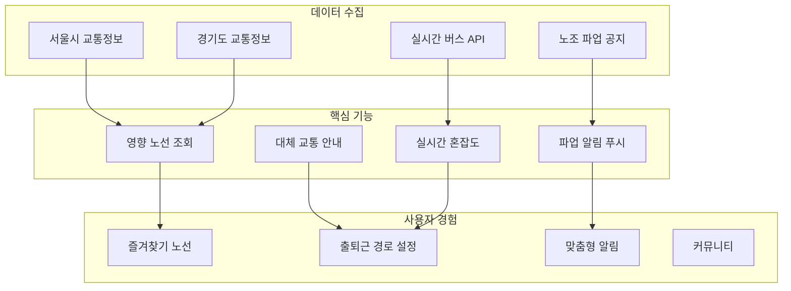
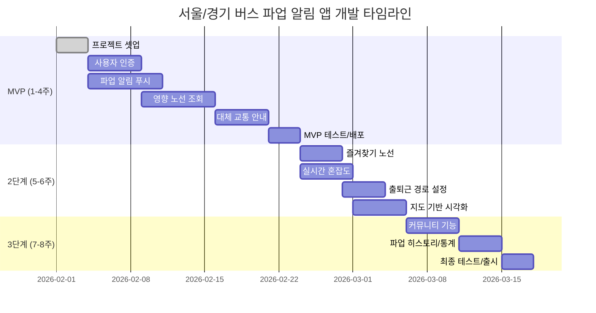
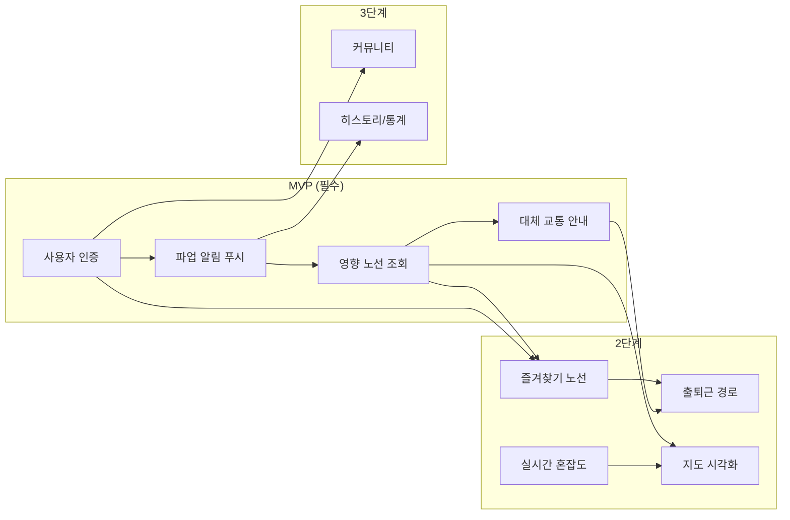

# 서울/경기 버스 파업 알림 앱 로드맵

> **버스 파업 정보를 실시간으로 제공하고, 대체 교통수단을 안내하여 시민들의 출퇴근 불편을 최소화하는 모바일 앱**

## 프로덕트 비전 다이어그램

## 기술 스택

| 영역 | 기술 | 선정 이유 |
|------|------|-----------|
| **Frontend** | React Native | iOS/Android 동시 개발, 빠른 개발 속도 |
| **Backend** | Node.js + Express | 실시간 처리, JavaScript 생태계 |
| **Database** | PostgreSQL + Redis | 관계형 데이터 + 실시간 캐싱 |
| **Push** | Firebase Cloud Messaging | 크로스 플랫폼 푸시 알림 |
| **API** | 공공데이터포털 API | 서울/경기 버스 정보 |
| **배포** | AWS (EC2, RDS, ElastiCache) | 확장성, 안정성 |

## 요약

| 항목 | 수치 |
|------|------|
| **총 기능 수** | 10개 |
| **P0 (필수)** | 4개 |
| **P1 (중요)** | 4개 |
| **P2 (선택)** | 2개 |
| **예상 개발 기간** | 8주 |

## 단계별 기능 테이블

| 번호 | 기능명 | 우선순위 | 단계 | 문서 링크 |
|------|--------|----------|------|-----------|
| 01 | 파업 알림 푸시 | P0 | MVP | [feature-01-push-notification.md](./feature-01-push-notification.md) |
| 02 | 영향 노선 조회 | P0 | MVP | [feature-02-affected-routes.md](./feature-02-affected-routes.md) |
| 03 | 대체 교통 안내 | P0 | MVP | [feature-03-alternative-transport.md](./feature-03-alternative-transport.md) |
| 04 | 사용자 인증 | P0 | MVP | [feature-04-authentication.md](./feature-04-authentication.md) |
| 05 | 즐겨찾기 노선 관리 | P1 | 2단계 | [feature-05-favorite-routes.md](./feature-05-favorite-routes.md) |
| 06 | 실시간 혼잡도 | P1 | 2단계 | [feature-06-congestion-info.md](./feature-06-congestion-info.md) |
| 07 | 출퇴근 경로 설정 | P1 | 2단계 | [feature-07-commute-route.md](./feature-07-commute-route.md) |
| 08 | 지도 기반 시각화 | P1 | 2단계 | [feature-08-map-visualization.md](./feature-08-map-visualization.md) |
| 09 | 커뮤니티 (실시간 제보) | P2 | 3단계 | [feature-09-community.md](./feature-09-community.md) |
| 10 | 파업 히스토리/통계 | P2 | 3단계 | [feature-10-history-stats.md](./feature-10-history-stats.md) |

## 타임라인

## 기능 의존성 그래프

## 수익화 전략

| 전략 | 내용 | 예상 수익 |
|------|------|-----------|
| **프리미엄 구독** | 광고 제거, 상세 통계, 무제한 즐겨찾기 | 월 2,900원 |
| **광고** | 배너 광고, 네이티브 광고 | CPM 기반 |
| **API 제공** | 기업/기관용 파업 정보 API | 월정액 |
| **제휴** | 택시, 공유킥보드 업체 연계 | 수수료 |

## 주요 API 연동

| API | 제공처 | 용도 |
|-----|--------|------|
| 서울시 버스 도착 정보 | 서울열린데이터광장 | 실시간 버스 정보 |
| 경기도 버스 정보 | 경기데이터드림 | 경기 버스 정보 |
| 지하철 실시간 정보 | 서울열린데이터광장 | 대체 교통 안내 |
| 카카오맵 API | 카카오 | 지도, 경로 안내 |
| TOPIS | 서울시 | 교통 혼잡도 |

## 출처

- [서울열린데이터광장](https://data.seoul.go.kr/)
- [경기데이터드림](https://data.gg.go.kr/)
- [공공데이터포털](https://www.data.go.kr/)
