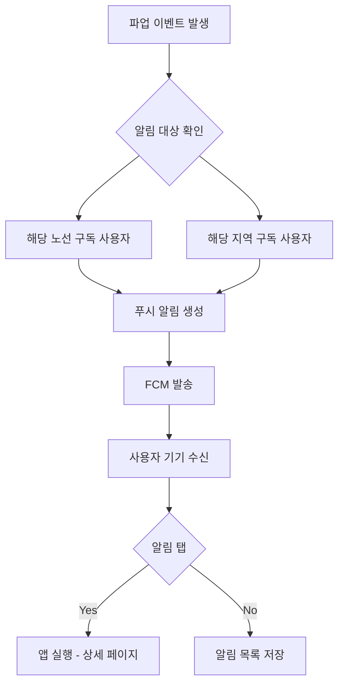

# Feature 01: 파업 알림 푸시

## 속성

| 항목 | 내용 |
|------|------|
| **우선순위** | P0 (필수) |
| **복잡도** | Medium |
| **단계** | MVP |
| **의존성** | feature-04-authentication.md |

## 개요

사용자가 등록한 노선 또는 지역에 파업이 예정되거나 발생했을 때 즉시 푸시 알림을 발송한다. 파업 시작, 협상 진행, 파업 종료 등 주요 이벤트를 실시간으로 알려 시민들이 사전에 대비할 수 있도록 한다.

## 사용자 스토리

| 역할 | 행동 | 기대 결과 |
|------|------|-----------|
| 출퇴근 시민 | 내 노선 파업 알림 받기 | 파업 예정 시 사전 알림 수신 |
| 경기도민 | 서울행 버스 파업 알림 받기 | 출근 전 대체 교통 준비 |
| 일반 사용자 | 파업 종료 알림 받기 | 정상 운행 재개 시점 확인 |
| 관리자 | 긴급 공지 발송 | 전체 사용자에게 긴급 알림 |

## 비즈니스 규칙

| 규칙 | 설명 |
|------|------|
| 알림 타이밍 | 파업 확정 즉시, 파업 24시간 전, 파업 1시간 전, 파업 시작, 파업 종료 |
| 알림 우선순위 | 긴급(파업 시작) > 높음(파업 확정) > 보통(협상 진행) |
| 야간 알림 제한 | 22:00~07:00 긴급 외 알림 제한 (사용자 설정 가능) |
| 중복 방지 | 동일 이벤트 알림 1회만 발송 |

## 화면 흐름



## API 명세

| 메서드 | 경로 | 설명 |
|--------|------|------|
| POST | /api/notifications/subscribe | 노선/지역 알림 구독 |
| DELETE | /api/notifications/unsubscribe | 알림 구독 취소 |
| GET | /api/notifications | 알림 목록 조회 |
| PUT | /api/notifications/settings | 알림 설정 변경 |
| POST | /api/admin/notifications/broadcast | 전체 알림 발송 (관리자) |

## 주요 API 요청/응답 예시

### 알림 구독
```json
// POST /api/notifications/subscribe
// Request
{
  "type": "route",
  "routeIds": ["100", "143", "240"],
  "region": "seoul"
}

// Response
{
  "success": true,
  "subscriptions": [
    { "type": "route", "routeId": "100", "routeName": "100번" },
    { "type": "route", "routeId": "143", "routeName": "143번" },
    { "type": "route", "routeId": "240", "routeName": "240번" }
  ]
}
```

### 알림 수신 페이로드
```json
{
  "notification": {
    "title": "[긴급] 서울 시내버스 파업 시작",
    "body": "오늘 04:00부터 서울 시내버스 390개 노선 운행이 중단됩니다."
  },
  "data": {
    "type": "strike_start",
    "strikeId": "STK-2026-001",
    "affectedRoutes": ["100", "143", "240"],
    "startTime": "2026-01-13T04:00:00+09:00",
    "deepLink": "busapp://strike/STK-2026-001"
  }
}
```

## 완료 조건 체크리스트

- [ ] FCM 연동 및 토큰 관리
- [ ] 노선/지역별 구독 기능
- [ ] 알림 설정 (시간대, 유형별)
- [ ] 알림 목록 저장 및 조회
- [ ] 딥링크로 상세 페이지 이동
- [ ] 야간 알림 제한 옵션
- [ ] 관리자 전체 알림 발송
- [ ] 알림 통계 (발송/수신/클릭률)
