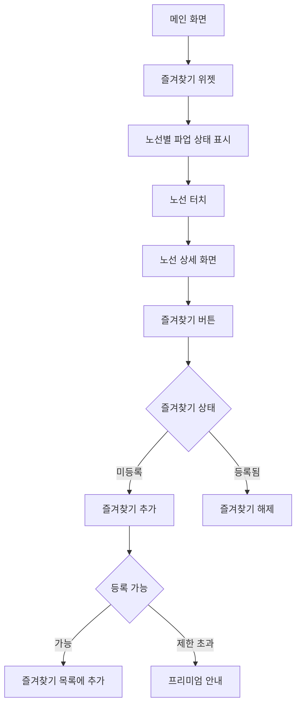

# Feature 05: 즐겨찾기 노선 관리

## 속성

| 항목 | 내용 |
|------|------|
| **우선순위** | P1 (중요) |
| **복잡도** | Low |
| **단계** | 2단계 |
| **의존성** | feature-04-authentication.md, feature-02-affected-routes.md |

## 개요

자주 이용하는 버스 노선을 즐겨찾기로 등록하여 파업 시 해당 노선의 영향 여부를 빠르게 확인할 수 있다. 즐겨찾기 노선에 파업이 발생하면 우선적으로 푸시 알림을 받을 수 있다.

## 사용자 스토리

| 역할 | 행동 | 기대 결과 |
|------|------|-----------|
| 사용자 | 노선 즐겨찾기 추가 | 메인 화면에서 바로 확인 |
| 사용자 | 즐겨찾기 노선 파업 확인 | 한눈에 영향 여부 파악 |
| 사용자 | 즐겨찾기 순서 변경 | 중요한 노선 상단 배치 |
| 사용자 | 즐겨찾기 알림 설정 | 해당 노선만 알림 수신 |

## 비즈니스 규칙

| 규칙 | 설명 |
|------|------|
| 등록 제한 | 무료 회원 5개, 프리미엄 무제한 |
| 동기화 | 다중 기기 간 즐겨찾기 동기화 |
| 정렬 | 사용자 지정 순서 또는 노선번호순 |
| 알림 연동 | 즐겨찾기 노선 자동 알림 구독 |

## 화면 흐름



## API 명세

| 메서드 | 경로 | 설명 |
|--------|------|------|
| GET | /api/favorites | 즐겨찾기 목록 조회 |
| POST | /api/favorites | 즐겨찾기 추가 |
| DELETE | /api/favorites/{routeId} | 즐겨찾기 삭제 |
| PUT | /api/favorites/order | 즐겨찾기 순서 변경 |

## 주요 API 요청/응답 예시

### 즐겨찾기 목록 조회
```json
// GET /api/favorites
// Response
{
  "count": 3,
  "limit": 5,
  "favorites": [
    {
      "routeId": "143",
      "routeName": "143번",
      "type": "trunk",
      "order": 1,
      "strikeStatus": "suspended",
      "addedAt": "2026-01-10T09:00:00+09:00"
    },
    {
      "routeId": "240",
      "routeName": "240번",
      "type": "trunk",
      "order": 2,
      "strikeStatus": "normal",
      "addedAt": "2026-01-11T10:00:00+09:00"
    }
  ]
}
```

### 즐겨찾기 추가
```json
// POST /api/favorites
// Request
{
  "routeId": "100"
}

// Response
{
  "success": true,
  "favorite": {
    "routeId": "100",
    "routeName": "100번",
    "order": 3,
    "notificationEnabled": true
  },
  "remaining": 2
}
```

## 완료 조건 체크리스트

- [ ] 즐겨찾기 추가/삭제 기능
- [ ] 즐겨찾기 목록 조회
- [ ] 드래그 앤 드롭 순서 변경
- [ ] 파업 상태 실시간 표시
- [ ] 무료/프리미엄 등록 제한
- [ ] 알림 자동 연동
- [ ] 오프라인 캐싱
