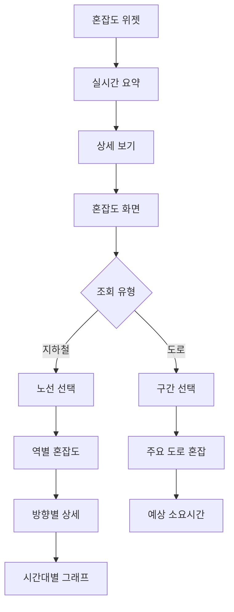

# Feature 06: 실시간 혼잡도

## 속성

| 항목 | 내용 |
|------|------|
| **우선순위** | P1 (중요) |
| **복잡도** | Medium |
| **단계** | 2단계 |
| **의존성** | feature-03-alternative-transport.md |

## 개요

파업 시 지하철, 대체 버스, 도로의 실시간 혼잡도를 제공한다. 사용자가 출퇴근 경로를 선택할 때 혼잡도를 고려하여 최적의 시간대와 경로를 선택할 수 있도록 돕는다.

## 사용자 스토리

| 역할 | 행동 | 기대 결과 |
|------|------|-----------|
| 시민 | 지하철 혼잡도 확인 | 붐비지 않는 노선/시간 선택 |
| 시민 | 도로 혼잡도 확인 | 택시 이용 시 예상 시간 파악 |
| 시민 | 시간대별 혼잡 예측 | 출근 시간 조정 |
| 시민 | 혼잡도 알림 받기 | 혼잡도 완화 시 알림 |

## 비즈니스 규칙

| 규칙 | 설명 |
|------|------|
| 데이터 갱신 | 지하철 5분, 도로 10분 주기 |
| 혼잡도 단계 | 여유(~100%) / 보통(100~150%) / 혼잡(150~180%) / 매우혼잡(180%~) |
| 예측 제공 | 과거 데이터 기반 시간대별 예측 |
| 알림 조건 | 혼잡 → 보통 전환 시 알림 |

## 화면 흐름



## API 명세

| 메서드 | 경로 | 설명 |
|--------|------|------|
| GET | /api/congestion/subway | 지하철 혼잡도 |
| GET | /api/congestion/subway/{line} | 노선별 혼잡도 |
| GET | /api/congestion/road | 도로 혼잡도 |
| GET | /api/congestion/forecast | 시간대별 예측 |

## 주요 API 요청/응답 예시

### 지하철 노선별 혼잡도
```json
// GET /api/congestion/subway/2
// Response
{
  "line": "2호선",
  "updatedAt": "2026-01-13T08:30:00+09:00",
  "stations": [
    {
      "station": "강남",
      "inner": { "level": 185, "status": "very_crowded" },
      "outer": { "level": 150, "status": "crowded" }
    },
    {
      "station": "역삼",
      "inner": { "level": 170, "status": "crowded" },
      "outer": { "level": 140, "status": "moderate" }
    },
    {
      "station": "선릉",
      "inner": { "level": 160, "status": "crowded" },
      "outer": { "level": 130, "status": "moderate" }
    }
  ]
}
```

### 시간대별 예측
```json
// GET /api/congestion/forecast?line=2&station=강남
// Response
{
  "station": "강남",
  "line": "2호선",
  "forecast": [
    { "time": "07:00", "inner": 120, "outer": 100 },
    { "time": "07:30", "inner": 150, "outer": 130 },
    { "time": "08:00", "inner": 180, "outer": 160 },
    { "time": "08:30", "inner": 190, "outer": 170 },
    { "time": "09:00", "inner": 170, "outer": 150 },
    { "time": "09:30", "inner": 140, "outer": 120 }
  ],
  "recommendation": "08:30 이전 또는 09:30 이후 이용 권장"
}
```

## 완료 조건 체크리스트

- [ ] 지하철 실시간 혼잡도 연동 (서울교통공사 API)
- [ ] 역별/방향별 혼잡도 표시
- [ ] 도로 혼잡도 연동 (TOPIS)
- [ ] 시간대별 예측 그래프
- [ ] 혼잡도 색상 시각화
- [ ] 혼잡도 완화 알림
- [ ] 위젯 지원 (iOS/Android)
