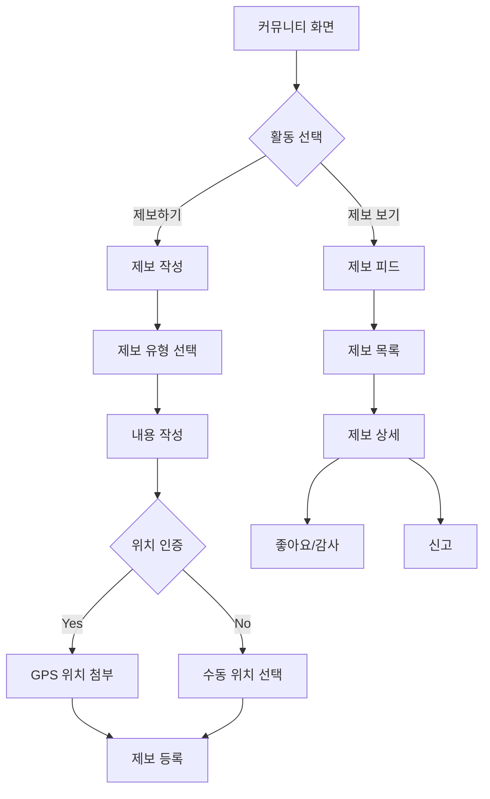

# Feature 09: 커뮤니티 (실시간 제보)

## 속성

| 항목 | 내용 |
|------|------|
| **우선순위** | P2 (선택) |
| **복잡도** | Medium |
| **단계** | 3단계 |
| **의존성** | feature-04-authentication.md |

## 개요

사용자들이 실시간으로 현장 상황을 제보하고 공유하는 커뮤니티 기능이다. 파업 현장의 실제 상황, 대체 교통 이용 팁, 혼잡 구간 정보 등을 사용자 간에 공유하여 공식 정보를 보완한다.

## 사용자 스토리

| 역할 | 행동 | 기대 결과 |
|------|------|-----------|
| 시민 | 현장 상황 제보 | 다른 사용자에게 실시간 정보 공유 |
| 시민 | 제보 확인 | 실제 이용자의 생생한 정보 확인 |
| 시민 | 제보에 반응 | 유용한 정보에 좋아요/감사 표시 |
| 시민 | 대체 교통 팁 공유 | 효율적인 우회 경로 공유 |

## 비즈니스 규칙

| 규칙 | 설명 |
|------|------|
| 제보 유형 | 현장상황, 대체교통, 혼잡도, 기타 |
| 위치 인증 | GPS 기반 위치 인증 (선택) |
| 신뢰도 | 위치 인증 + 사용자 등급 기반 |
| 유효 기간 | 제보 후 2시간 (자동 만료) |
| 신고 처리 | 허위 제보 신고 시 검토 후 삭제 |

## 화면 흐름



## API 명세

| 메서드 | 경로 | 설명 |
|--------|------|------|
| GET | /api/reports | 제보 목록 조회 |
| POST | /api/reports | 제보 등록 |
| GET | /api/reports/{id} | 제보 상세 |
| POST | /api/reports/{id}/like | 좋아요 |
| POST | /api/reports/{id}/flag | 신고 |
| DELETE | /api/reports/{id} | 제보 삭제 (본인) |

## 주요 API 요청/응답 예시

### 제보 등록
```json
// POST /api/reports
// Request
{
  "type": "situation",
  "content": "강남역 2호선 내선 방면 매우 혼잡합니다. 2-3대 기다려야 탑승 가능해요.",
  "location": {
    "name": "강남역",
    "lat": 37.4979,
    "lng": 127.0276,
    "verified": true
  },
  "tags": ["지하철", "2호선", "혼잡"]
}

// Response
{
  "id": "rpt_12345",
  "type": "situation",
  "content": "강남역 2호선 내선 방면 매우 혼잡합니다...",
  "author": {
    "nickname": "출근러",
    "level": "trusted"
  },
  "location": {
    "name": "강남역",
    "verified": true
  },
  "likes": 0,
  "expiresAt": "2026-01-13T10:30:00+09:00",
  "createdAt": "2026-01-13T08:30:00+09:00"
}
```

### 제보 목록 조회
```json
// GET /api/reports?lat=37.5&lng=127.0&radius=5000&type=all
// Response
{
  "reports": [
    {
      "id": "rpt_12345",
      "type": "situation",
      "content": "강남역 2호선 내선 방면 매우 혼잡합니다...",
      "author": { "nickname": "출근러", "level": "trusted" },
      "location": { "name": "강남역", "verified": true },
      "distance": 500,
      "likes": 23,
      "createdAt": "2026-01-13T08:30:00+09:00"
    },
    {
      "id": "rpt_12346",
      "type": "tip",
      "content": "사당역에서 4호선 환승하면 2호선보다 빠릅니다!",
      "author": { "nickname": "교통전문가", "level": "expert" },
      "location": { "name": "사당역", "verified": false },
      "distance": 3000,
      "likes": 45,
      "createdAt": "2026-01-13T08:15:00+09:00"
    }
  ]
}
```

## 완료 조건 체크리스트

- [ ] 제보 CRUD 기능
- [ ] GPS 기반 위치 인증
- [ ] 제보 유형별 필터링
- [ ] 좋아요/감사 기능
- [ ] 허위 제보 신고
- [ ] 제보 자동 만료 (2시간)
- [ ] 사용자 신뢰도 등급
- [ ] 실시간 피드 업데이트
- [ ] 지도 연동 (제보 위치 표시)
