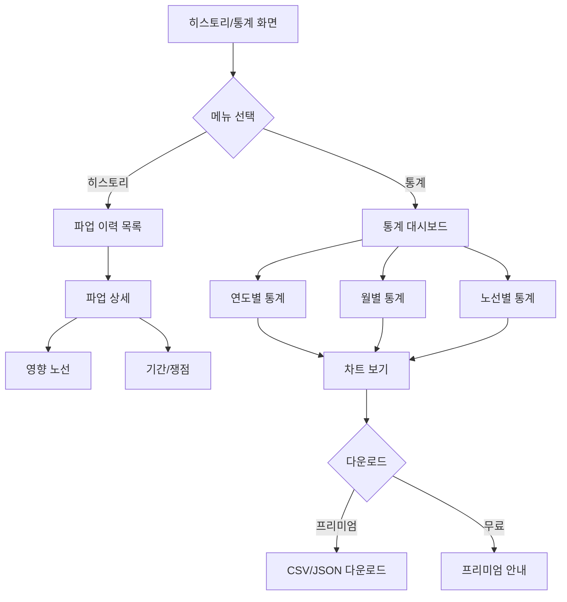
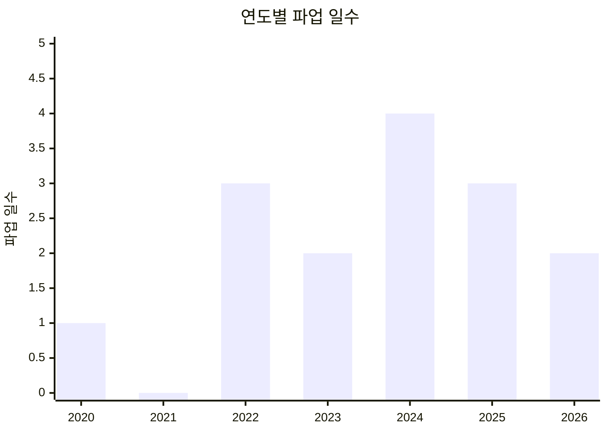
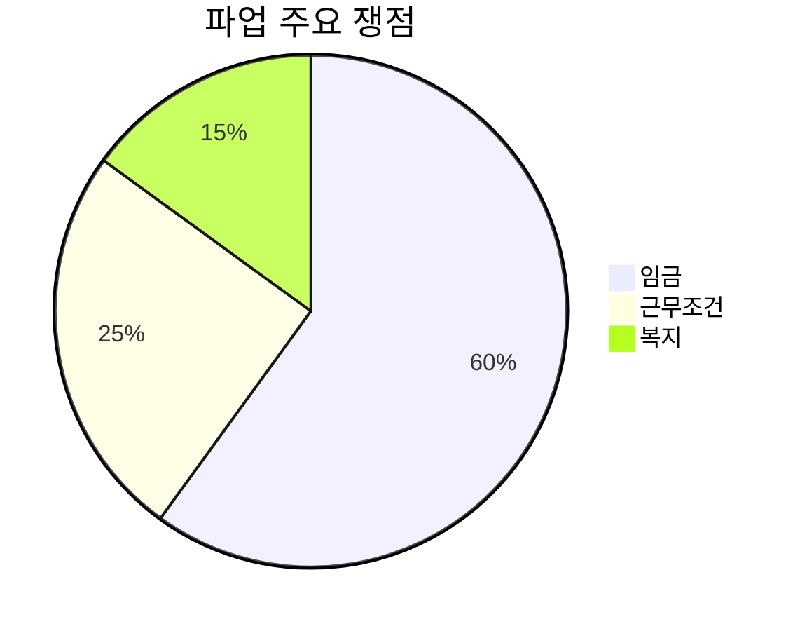

# Feature 10: 파업 히스토리/통계

## 속성

| 항목 | 내용 |
|------|------|
| **우선순위** | P2 (선택) |
| **복잡도** | Medium |
| **단계** | 3단계 |
| **의존성** | feature-01-push-notification.md |

## 개요

과거 파업 이력과 통계를 제공하여 사용자가 파업 패턴을 이해하고 향후 대비할 수 있도록 한다. 파업 빈도, 평균 기간, 주요 쟁점 등의 데이터를 시각화하여 제공한다.

## 사용자 스토리

| 역할 | 행동 | 기대 결과 |
|------|------|-----------|
| 시민 | 과거 파업 이력 조회 | 언제, 얼마나 파업이 있었는지 확인 |
| 시민 | 파업 통계 확인 | 평균 기간, 빈도 등 패턴 파악 |
| 시민 | 노선별 파업 이력 | 특정 노선의 파업 히스토리 확인 |
| 연구자 | 데이터 다운로드 | 분석용 데이터 확보 |

## 비즈니스 규칙

| 규칙 | 설명 |
|------|------|
| 데이터 범위 | 2020년 이후 파업 기록 |
| 통계 갱신 | 파업 종료 후 24시간 내 반영 |
| 데이터 제공 | 기본(무료), 상세(프리미엄) |
| 다운로드 | CSV/JSON 형식 (프리미엄) |

## 화면 흐름



## API 명세

| 메서드 | 경로 | 설명 |
|--------|------|------|
| GET | /api/strikes/history | 파업 이력 목록 |
| GET | /api/strikes/{id} | 파업 상세 |
| GET | /api/stats/overview | 전체 통계 개요 |
| GET | /api/stats/yearly | 연도별 통계 |
| GET | /api/stats/routes/{routeId} | 노선별 통계 |
| GET | /api/stats/export | 데이터 다운로드 |

## 주요 API 요청/응답 예시

### 파업 이력 목록
```json
// GET /api/strikes/history?year=2026
// Response
{
  "year": 2026,
  "total": 1,
  "strikes": [
    {
      "id": "STK-2026-001",
      "title": "2026년 1월 서울 시내버스 파업",
      "startTime": "2026-01-13T04:00:00+09:00",
      "endTime": "2026-01-14T23:50:00+09:00",
      "duration": "44시간",
      "affectedRoutes": 390,
      "region": "seoul",
      "mainIssue": "통상임금, 임금인상",
      "result": "2.9% 임금인상, 정년 65세 연장 합의"
    }
  ]
}
```

### 전체 통계 개요
```json
// GET /api/stats/overview
// Response
{
  "period": "2020-2026",
  "totalStrikes": 8,
  "totalDays": 15,
  "averageDuration": "1.9일",
  "mostAffectedRegion": "seoul",
  "mostCommonIssue": "임금",
  "yearlyTrend": [
    { "year": 2020, "count": 1, "totalDays": 1 },
    { "year": 2021, "count": 0, "totalDays": 0 },
    { "year": 2022, "count": 2, "totalDays": 3 },
    { "year": 2023, "count": 1, "totalDays": 2 },
    { "year": 2024, "count": 2, "totalDays": 4 },
    { "year": 2025, "count": 1, "totalDays": 3 },
    { "year": 2026, "count": 1, "totalDays": 2 }
  ],
  "issueDistribution": [
    { "issue": "임금", "percentage": 60 },
    { "issue": "근무조건", "percentage": 25 },
    { "issue": "복지", "percentage": 15 }
  ]
}
```

### 노선별 통계
```json
// GET /api/stats/routes/143
// Response
{
  "routeId": "143",
  "routeName": "143번",
  "totalAffected": 5,
  "lastAffected": "2026-01-14",
  "affectedStrikes": [
    {
      "strikeId": "STK-2026-001",
      "date": "2026-01-13",
      "duration": "44시간"
    },
    {
      "strikeId": "STK-2024-001",
      "date": "2024-03-28",
      "duration": "17시간"
    }
  ]
}
```

## 통계 시각화

### 연도별 파업 추이


### 주요 쟁점 분포


## 완료 조건 체크리스트

- [ ] 파업 이력 목록 및 상세 조회
- [ ] 연도별/월별 통계
- [ ] 노선별 파업 이력
- [ ] 차트 시각화 (막대, 파이, 라인)
- [ ] 주요 쟁점 분석
- [ ] 파업 결과 기록
- [ ] CSV/JSON 데이터 다운로드 (프리미엄)
- [ ] 검색 및 필터링
