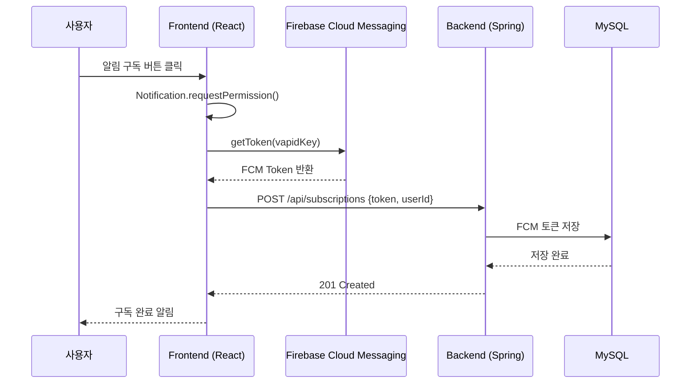
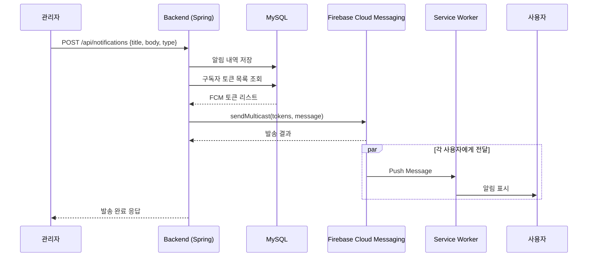
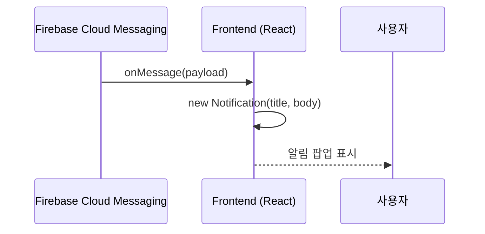
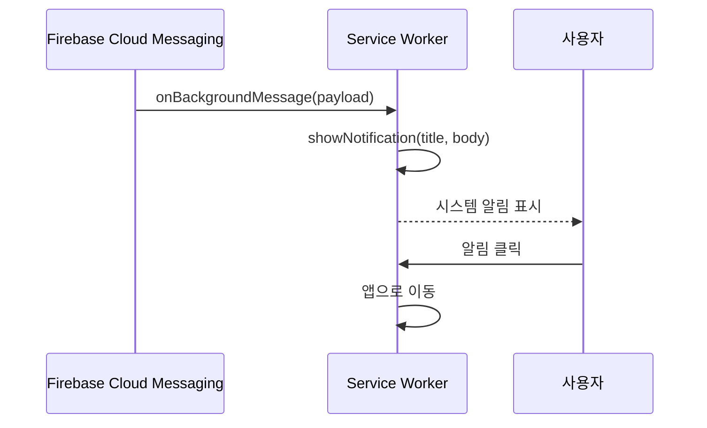

# 알림 기능 시퀀스 다이어그램

## 1. 알림 구독 (Subscribe)

## 2. 파업 알림 발송 (Send Notification)

## 3. 포그라운드 알림 수신

## 4. 백그라운드 알림 수신

## API 엔드포인트

| Method | Endpoint | 설명 |
|--------|----------|------|
| POST | /api/subscriptions | FCM 토큰 등록 |
| DELETE | /api/subscriptions | FCM 토큰 삭제 |
| POST | /api/notifications | 알림 발송 |
| GET | /api/notifications | 알림 목록 조회 |
