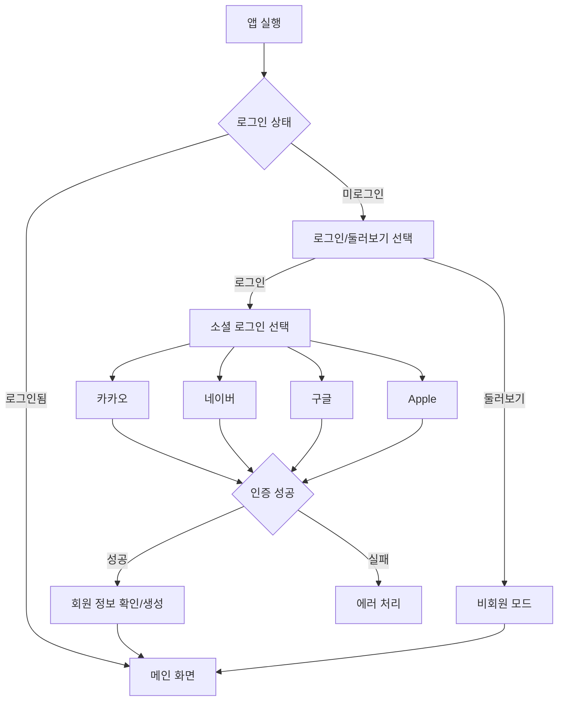
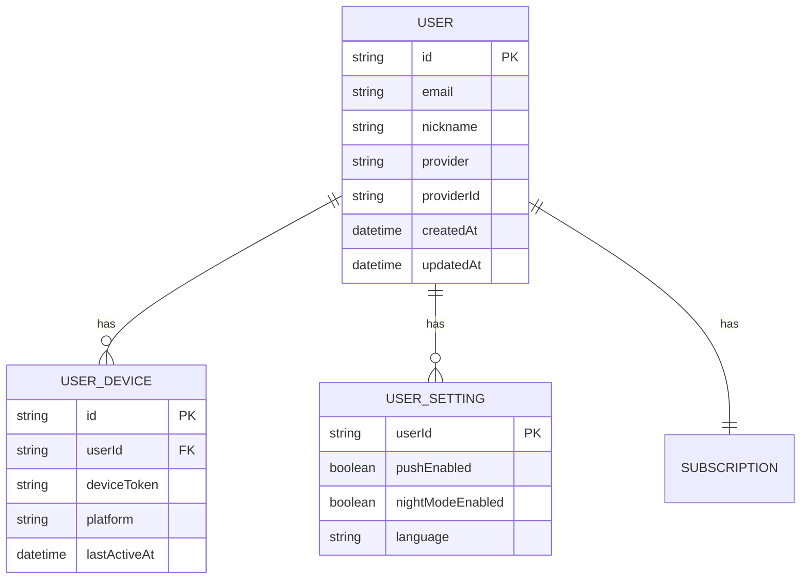

# Feature 04: 사용자 인증

## 속성

| 항목 | 내용 |
|------|------|
| **우선순위** | P0 (필수) |
| **복잡도** | Medium |
| **단계** | MVP |
| **의존성** | 없음 |

## 개요

소셜 로그인(카카오, 네이버, 구글, 애플)을 통한 간편 인증을 제공한다. 인증된 사용자는 즐겨찾기 노선, 알림 설정 등 개인화 기능을 이용할 수 있다. 비회원도 기본 기능(파업 정보 조회)을 이용할 수 있다.

## 사용자 스토리

| 역할 | 행동 | 기대 결과 |
|------|------|-----------|
| 신규 사용자 | 소셜 로그인으로 가입 | 3초 내 가입 완료 |
| 기존 사용자 | 자동 로그인 | 앱 실행 시 자동 인증 |
| 비회원 | 앱 둘러보기 | 기본 기능 이용 가능 |
| 사용자 | 계정 삭제 요청 | 모든 데이터 삭제 |

## 비즈니스 규칙

| 규칙 | 설명 |
|------|------|
| 소셜 로그인 | 카카오, 네이버, 구글, Apple 지원 |
| 토큰 관리 | JWT Access Token (1시간) + Refresh Token (30일) |
| 비회원 기능 | 파업 정보 조회, 대체 교통 검색 가능 |
| 회원 전용 | 푸시 알림, 즐겨찾기, 출퇴근 경로 설정 |
| 개인정보 | 최소 수집 (이메일, 닉네임만) |

## 화면 흐름



## API 명세

| 메서드 | 경로 | 설명 |
|--------|------|------|
| POST | /api/auth/social | 소셜 로그인 |
| POST | /api/auth/refresh | 토큰 갱신 |
| POST | /api/auth/logout | 로그아웃 |
| GET | /api/users/me | 내 정보 조회 |
| PUT | /api/users/me | 내 정보 수정 |
| DELETE | /api/users/me | 계정 삭제 |

## 주요 API 요청/응답 예시

### 소셜 로그인
```json
// POST /api/auth/social
// Request
{
  "provider": "kakao",
  "accessToken": "kakao_access_token_here",
  "deviceToken": "fcm_device_token_here"
}

// Response
{
  "accessToken": "eyJhbGciOiJIUzI1NiIs...",
  "refreshToken": "eyJhbGciOiJIUzI1NiIs...",
  "expiresIn": 3600,
  "user": {
    "id": "usr_12345",
    "email": "user@example.com",
    "nickname": "홍길동",
    "provider": "kakao",
    "createdAt": "2026-01-13T10:00:00+09:00"
  },
  "isNewUser": false
}
```

### 토큰 갱신
```json
// POST /api/auth/refresh
// Request
{
  "refreshToken": "eyJhbGciOiJIUzI1NiIs..."
}

// Response
{
  "accessToken": "eyJhbGciOiJIUzI1NiIs...",
  "expiresIn": 3600
}
```

### 내 정보 조회
```json
// GET /api/users/me
// Response
{
  "id": "usr_12345",
  "email": "user@example.com",
  "nickname": "홍길동",
  "provider": "kakao",
  "settings": {
    "pushEnabled": true,
    "nightModeEnabled": false
  },
  "subscription": {
    "type": "free",
    "expiresAt": null
  },
  "createdAt": "2026-01-13T10:00:00+09:00"
}
```

## 데이터 모델



## 완료 조건 체크리스트

- [ ] 카카오 로그인 연동
- [ ] 네이버 로그인 연동
- [ ] 구글 로그인 연동
- [ ] Apple 로그인 연동
- [ ] JWT 토큰 발급 및 갱신
- [ ] FCM 디바이스 토큰 등록
- [ ] 비회원 모드 지원
- [ ] 계정 삭제 (GDPR 준수)
- [ ] 자동 로그인 (Secure Storage)
- [ ] 로그아웃 처리
