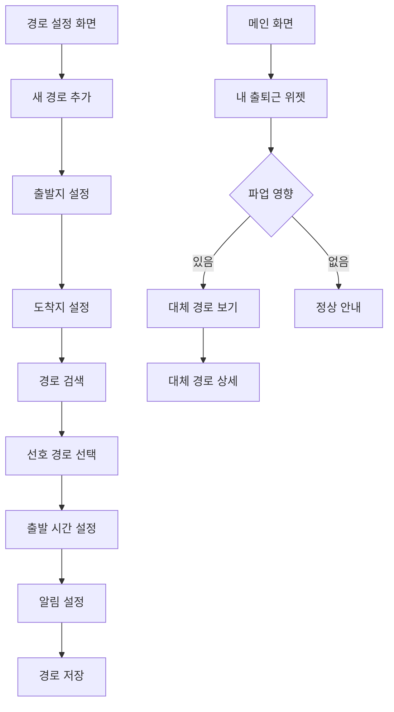

# Feature 07: 출퇴근 경로 설정

## 속성

| 항목 | 내용 |
|------|------|
| **우선순위** | P1 (중요) |
| **복잡도** | Medium |
| **단계** | 2단계 |
| **의존성** | feature-04-authentication.md, feature-03-alternative-transport.md |

## 개요

사용자의 집과 직장/학교 위치를 등록하여 출퇴근 경로를 설정한다. 파업 발생 시 설정된 경로에 영향이 있는지 자동으로 분석하고, 맞춤형 대체 경로를 제안한다.

## 사용자 스토리

| 역할 | 행동 | 기대 결과 |
|------|------|-----------|
| 직장인 | 집-회사 경로 등록 | 매일 자동으로 파업 영향 확인 |
| 학생 | 집-학교 경로 등록 | 등교 전 대체 경로 알림 |
| 사용자 | 여러 경로 등록 | 상황별 다른 경로 관리 |
| 사용자 | 출근 시간 설정 | 해당 시간 전 알림 수신 |

## 비즈니스 규칙

| 규칙 | 설명 |
|------|------|
| 경로 등록 | 무료 2개, 프리미엄 5개 |
| 알림 시간 | 출발 예정 시간 1시간/30분 전 |
| 자동 분석 | 경로 내 버스 노선 자동 추출 |
| 대체 경로 | 파업 시 자동으로 대체 경로 계산 |

## 화면 흐름



## API 명세

| 메서드 | 경로 | 설명 |
|--------|------|------|
| GET | /api/commutes | 등록된 경로 목록 |
| POST | /api/commutes | 새 경로 등록 |
| PUT | /api/commutes/{id} | 경로 수정 |
| DELETE | /api/commutes/{id} | 경로 삭제 |
| GET | /api/commutes/{id}/status | 경로 파업 영향 상태 |
| GET | /api/commutes/{id}/alternative | 대체 경로 조회 |

## 주요 API 요청/응답 예시

### 경로 등록
```json
// POST /api/commutes
// Request
{
  "name": "출근",
  "origin": {
    "name": "우리집",
    "address": "서울시 강남구 역삼동 123",
    "lat": 37.5000,
    "lng": 127.0360
  },
  "destination": {
    "name": "회사",
    "address": "서울시 중구 을지로 100",
    "lat": 37.5660,
    "lng": 126.9850
  },
  "departureTime": "08:00",
  "daysOfWeek": ["mon", "tue", "wed", "thu", "fri"],
  "notificationBefore": [60, 30]
}

// Response
{
  "id": "comm_123",
  "name": "출근",
  "routes": [
    {
      "type": "bus_subway",
      "totalTime": 45,
      "buses": ["143", "240"],
      "subways": ["2호선"]
    }
  ],
  "affectedBuses": ["143", "240"],
  "createdAt": "2026-01-10T10:00:00+09:00"
}
```

### 파업 영향 상태
```json
// GET /api/commutes/comm_123/status
// Response
{
  "commuteId": "comm_123",
  "name": "출근",
  "isAffected": true,
  "affectedRoutes": [
    {
      "routeId": "143",
      "routeName": "143번",
      "status": "suspended"
    }
  ],
  "normalRoutes": [
    {
      "routeId": "240",
      "routeName": "240번",
      "status": "normal"
    }
  ],
  "recommendation": "지하철 2호선 이용 권장",
  "alternativeAvailable": true
}
```

## 완료 조건 체크리스트

- [ ] 출발지/도착지 주소 검색 및 저장
- [ ] 경로 내 버스 노선 자동 추출
- [ ] 출발 시간/요일 설정
- [ ] 파업 영향 자동 분석
- [ ] 대체 경로 자동 계산
- [ ] 맞춤형 알림 발송
- [ ] 경로별 즐겨찾기 연동
- [ ] 위젯 지원
