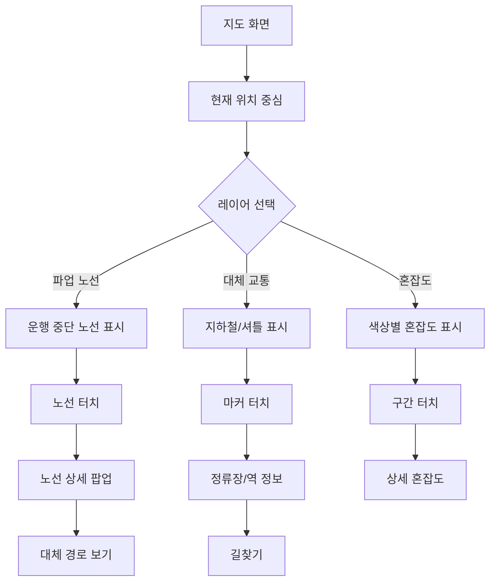

# Feature 08: 지도 기반 시각화

## 속성

| 항목 | 내용 |
|------|------|
| **우선순위** | P1 (중요) |
| **복잡도** | High |
| **단계** | 2단계 |
| **의존성** | feature-02-affected-routes.md, feature-06-congestion-info.md |

## 개요

지도 위에 파업 영향 노선, 대체 교통, 실시간 혼잡도를 시각적으로 표시한다. 사용자가 직관적으로 파업 상황을 파악하고 이동 경로를 계획할 수 있도록 한다.

## 사용자 스토리

| 역할 | 행동 | 기대 결과 |
|------|------|-----------|
| 시민 | 지도에서 파업 노선 확인 | 운행 중단 구간 시각적 파악 |
| 시민 | 대체 교통 위치 확인 | 가까운 지하철역, 셔틀 정류장 확인 |
| 시민 | 혼잡도 지도 확인 | 혼잡 지역 회피 경로 선택 |
| 시민 | 현재 위치 기반 안내 | 주변 대체 교통 바로 확인 |

## 비즈니스 규칙

| 규칙 | 설명 |
|------|------|
| 지도 제공자 | 카카오맵 또는 네이버지도 SDK |
| 레이어 구분 | 파업 노선(빨강), 정상 노선(파랑), 대체 교통(초록) |
| 갱신 주기 | 혼잡도 5분, 버스 위치 1분 |
| 줌 레벨 | 서울/경기 전체 ~ 정류장 단위 |

## 화면 흐름



## API 명세

| 메서드 | 경로 | 설명 |
|--------|------|------|
| GET | /api/map/routes | 지도용 노선 데이터 |
| GET | /api/map/stops | 지도용 정류장 데이터 |
| GET | /api/map/alternatives | 대체 교통 위치 |
| GET | /api/map/congestion | 혼잡도 히트맵 데이터 |

## 주요 API 요청/응답 예시

### 지도용 노선 데이터
```json
// GET /api/map/routes?bounds=37.4,126.8,37.7,127.2&strike=STK-2026-001
// Response
{
  "strikeId": "STK-2026-001",
  "routes": [
    {
      "routeId": "143",
      "routeName": "143번",
      "status": "suspended",
      "color": "#FF0000",
      "path": [
        [37.5665, 126.9780],
        [37.5700, 126.9820],
        [37.5750, 126.9900]
      ]
    },
    {
      "routeId": "마을01",
      "routeName": "강남01",
      "status": "normal",
      "color": "#00FF00",
      "path": [
        [37.4979, 127.0276],
        [37.5000, 127.0300]
      ]
    }
  ]
}
```

### 대체 교통 위치
```json
// GET /api/map/alternatives?lat=37.5665&lng=126.9780&radius=1000
// Response
{
  "center": { "lat": 37.5665, "lng": 126.9780 },
  "radius": 1000,
  "alternatives": [
    {
      "type": "subway",
      "name": "시청역",
      "lines": ["1호선", "2호선"],
      "lat": 37.5660,
      "lng": 126.9773,
      "distance": 150,
      "congestion": "crowded"
    },
    {
      "type": "shuttle",
      "name": "광화문 셔틀정류장",
      "routes": ["시청-강남"],
      "lat": 37.5710,
      "lng": 126.9768,
      "distance": 500,
      "nextArrival": "10분 후"
    }
  ]
}
```

### 혼잡도 히트맵
```json
// GET /api/map/congestion?bounds=37.4,126.8,37.7,127.2
// Response
{
  "heatmap": [
    { "lat": 37.4979, "lng": 127.0276, "weight": 0.9, "level": "very_crowded" },
    { "lat": 37.5550, "lng": 126.9707, "weight": 0.7, "level": "crowded" },
    { "lat": 37.5660, "lng": 126.9784, "weight": 0.5, "level": "moderate" }
  ],
  "updatedAt": "2026-01-13T08:30:00+09:00"
}
```

## 완료 조건 체크리스트

- [ ] 카카오맵/네이버지도 SDK 연동
- [ ] 파업 노선 폴리라인 표시
- [ ] 대체 교통 마커 표시
- [ ] 혼잡도 히트맵 레이어
- [ ] 현재 위치 기반 주변 검색
- [ ] 레이어 토글 기능
- [ ] 노선/마커 터치 상호작용
- [ ] 길찾기 연동
- [ ] 클러스터링 (축소 시)
