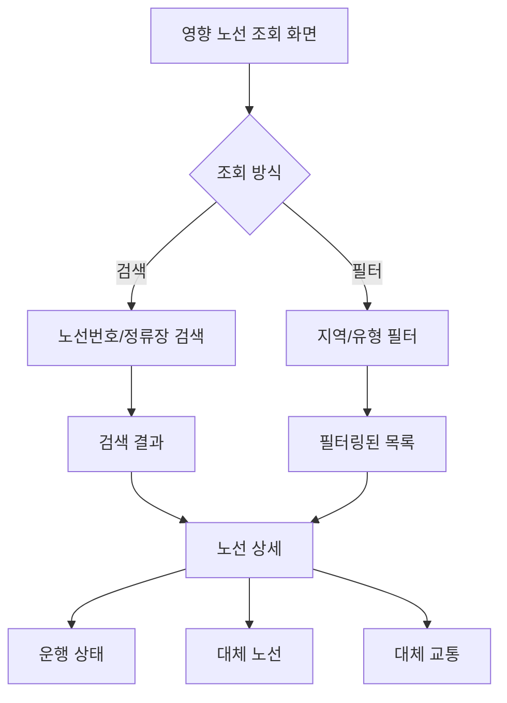
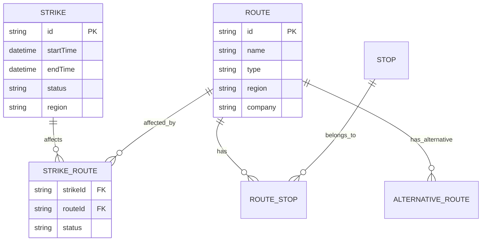

# Feature 02: 영향 노선 조회

## 속성

| 항목 | 내용 |
|------|------|
| **우선순위** | P0 (필수) |
| **복잡도** | Medium |
| **단계** | MVP |
| **의존성** | 없음 |

## 개요

파업 시 영향을 받는 버스 노선을 지역별, 버스 유형별로 조회할 수 있다. 사용자가 특정 노선 번호를 검색하면 해당 노선의 파업 영향 여부와 대체 노선을 안내한다.

## 사용자 스토리

| 역할 | 행동 | 기대 결과 |
|------|------|-----------|
| 시민 | 내 버스 노선 검색 | 파업 영향 여부 즉시 확인 |
| 시민 | 지역별 영향 노선 조회 | 해당 지역 전체 영향 노선 목록 확인 |
| 시민 | 버스 유형별 조회 | 간선/지선/광역 등 유형별 확인 |
| 경기도민 | 서울 경유 노선 조회 | 서울-경기 연계 노선 영향 확인 |

## 비즈니스 규칙

| 규칙 | 설명 |
|------|------|
| 데이터 갱신 | 파업 공지 후 1시간 내 반영 |
| 노선 분류 | 서울(간선/지선/순환/광역), 경기(광역/시내) |
| 영향 상태 | 운행중단, 부분운행, 정상운행 |
| 검색 범위 | 노선번호, 정류장명, 지역명 |

## 화면 흐름



## API 명세

| 메서드 | 경로 | 설명 |
|--------|------|------|
| GET | /api/strikes/{strikeId}/routes | 파업별 영향 노선 목록 |
| GET | /api/routes/search | 노선 검색 |
| GET | /api/routes/{routeId} | 노선 상세 정보 |
| GET | /api/routes/{routeId}/status | 노선 운행 상태 |
| GET | /api/regions/{regionId}/routes | 지역별 영향 노선 |

## 주요 API 요청/응답 예시

### 영향 노선 목록 조회
```json
// GET /api/strikes/STK-2026-001/routes?region=seoul&type=trunk
// Response
{
  "strikeId": "STK-2026-001",
  "totalCount": 390,
  "filteredCount": 120,
  "routes": [
    {
      "routeId": "100",
      "routeName": "100번",
      "type": "trunk",
      "region": "seoul",
      "status": "suspended",
      "company": "서울승합",
      "affectedStops": 45,
      "alternativeRoutes": ["143", "150"]
    },
    {
      "routeId": "143",
      "routeName": "143번",
      "type": "trunk",
      "region": "seoul",
      "status": "suspended",
      "company": "대원교통",
      "affectedStops": 38,
      "alternativeRoutes": ["100", "240"]
    }
  ]
}
```

### 노선 검색
```json
// GET /api/routes/search?q=143
// Response
{
  "results": [
    {
      "routeId": "143",
      "routeName": "143번",
      "type": "trunk",
      "region": "seoul",
      "startStop": "중랑공영차고지",
      "endStop": "서울역버스환승센터",
      "isAffected": true,
      "strikeStatus": "suspended"
    }
  ]
}
```

## 데이터 모델



## 완료 조건 체크리스트

- [ ] 파업별 영향 노선 목록 API
- [ ] 노선 검색 기능 (번호, 정류장명)
- [ ] 지역별 필터링 (서울/경기 시군)
- [ ] 버스 유형별 필터링
- [ ] 노선 상세 정보 (운행구간, 회사, 정류장)
- [ ] 운행 상태 표시 (운행중단/부분운행/정상)
- [ ] 대체 노선 추천
- [ ] 오프라인 캐싱 (최근 조회 노선)
