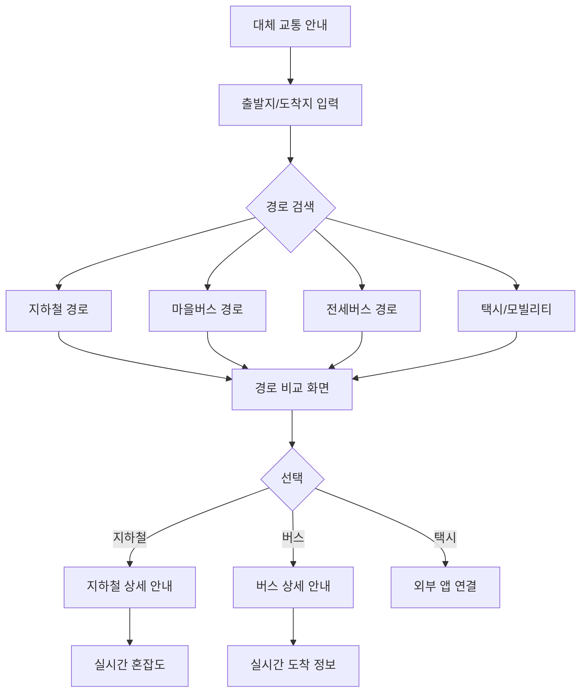

# Feature 03: 대체 교통 안내

## 속성

| 항목 | 내용 |
|------|------|
| **우선순위** | P0 (필수) |
| **복잡도** | High |
| **단계** | MVP |
| **의존성** | feature-02-affected-routes.md |

## 개요

파업으로 버스를 이용할 수 없을 때 지하철, 마을버스, 전세버스, 택시 등 대체 교통수단을 안내한다. 출발지와 도착지를 입력하면 파업 상황을 고려한 최적의 대체 경로를 제공한다.

## 사용자 스토리

| 역할 | 행동 | 기대 결과 |
|------|------|-----------|
| 시민 | 출퇴근 대체 경로 검색 | 파업 중 이용 가능한 최적 경로 확인 |
| 시민 | 지하철 연계 정보 확인 | 가장 가까운 지하철역과 노선 확인 |
| 시민 | 대체 버스 노선 확인 | 파업 미참여 마을버스, 전세버스 정보 |
| 시민 | 택시/공유 모빌리티 연결 | 대체 교통 앱으로 바로 이동 |

## 비즈니스 규칙

| 규칙 | 설명 |
|------|------|
| 경로 우선순위 | 1) 지하철 2) 마을버스 3) 전세버스 4) 택시 |
| 실시간 반영 | 지하철 혼잡도, 전세버스 배차 실시간 반영 |
| 경로 비교 | 소요시간, 비용, 환승횟수 비교 제공 |
| 연동 앱 | 카카오T, 타다, 카카오맵, 네이버지도 |

## 화면 흐름



## API 명세

| 메서드 | 경로 | 설명 |
|--------|------|------|
| GET | /api/alternative/routes | 대체 경로 검색 |
| GET | /api/alternative/subway | 지하철 연계 정보 |
| GET | /api/alternative/shuttle | 전세버스/셔틀 정보 |
| GET | /api/alternative/village-bus | 마을버스 정보 |
| GET | /api/subway/congestion | 지하철 실시간 혼잡도 |

## 주요 API 요청/응답 예시

### 대체 경로 검색
```json
// GET /api/alternative/routes?from=37.5665,126.9780&to=37.4979,127.0276
// Response
{
  "origin": {
    "name": "시청역",
    "lat": 37.5665,
    "lng": 126.9780
  },
  "destination": {
    "name": "강남역",
    "lat": 37.4979,
    "lng": 127.0276
  },
  "routes": [
    {
      "type": "subway",
      "totalTime": 35,
      "totalCost": 1400,
      "transfers": 1,
      "steps": [
        {
          "mode": "walk",
          "duration": 3,
          "instruction": "시청역 1호선 승강장으로 이동"
        },
        {
          "mode": "subway",
          "line": "1호선",
          "from": "시청",
          "to": "서울역",
          "duration": 5,
          "congestion": "moderate"
        },
        {
          "mode": "transfer",
          "duration": 5,
          "instruction": "4호선 환승"
        },
        {
          "mode": "subway",
          "line": "4호선",
          "from": "서울역",
          "to": "사당",
          "duration": 12,
          "congestion": "crowded"
        },
        {
          "mode": "transfer",
          "duration": 3,
          "instruction": "2호선 환승"
        },
        {
          "mode": "subway",
          "line": "2호선",
          "from": "사당",
          "to": "강남",
          "duration": 7,
          "congestion": "very_crowded"
        }
      ]
    },
    {
      "type": "shuttle",
      "totalTime": 45,
      "totalCost": 0,
      "transfers": 1,
      "steps": [
        {
          "mode": "walk",
          "duration": 5,
          "instruction": "광화문 셔틀버스 정류장으로 이동"
        },
        {
          "mode": "shuttle",
          "routeName": "시청-강남 셔틀",
          "from": "광화문",
          "to": "강남역",
          "duration": 40,
          "nextArrival": "10분 후"
        }
      ]
    },
    {
      "type": "taxi",
      "totalTime": 25,
      "totalCost": 15000,
      "transfers": 0,
      "deepLinks": {
        "kakaoT": "kakaot://...",
        "tada": "tada://..."
      }
    }
  ]
}
```

### 지하철 혼잡도
```json
// GET /api/subway/congestion?line=2&station=강남
// Response
{
  "line": "2호선",
  "station": "강남",
  "direction": {
    "inner": {
      "congestion": "very_crowded",
      "level": 180,
      "description": "매우 혼잡"
    },
    "outer": {
      "congestion": "crowded",
      "level": 150,
      "description": "혼잡"
    }
  },
  "updatedAt": "2026-01-13T08:30:00+09:00"
}
```

## 완료 조건 체크리스트

- [ ] 출발지/도착지 기반 대체 경로 검색
- [ ] 지하철 경로 + 실시간 혼잡도 연동
- [ ] 마을버스 경로 안내
- [ ] 전세버스/셔틀버스 정보 제공
- [ ] 택시 앱 딥링크 연동 (카카오T, 타다)
- [ ] 경로 비교 (시간/비용/환승)
- [ ] 즐겨찾기 경로 저장
- [ ] 도보 네비게이션 (정류장/역까지)
